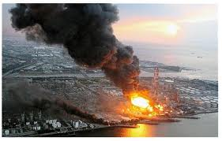

Volevo congratularmi con Zichichi per aver dichiarato che in Giappone non è successo niente di grave alla centrale nucleare. Volevo anche complimentarmi con Libero per aver utilizzato questa dichiarazione per difendere la campagna del nostro governo per la costruzione di centrali nucleari. Peccato che oggi anche il reattore 3 è a rischio esplosione Si vergognassero tutti e avessero il rispetto per le persone che sono morte e per le conseguenze che si porteranno dietro le popolazioni del luogo. In un paese a rischio sismico come il nostro è da pazzi a pensare al nucleare, una tecnologia ormai vecchia. Grazie anche per aver sospeso gli incentivi per il fotovoltaico. Che governo di furbi... Libero... che quotidiano ridicolo
