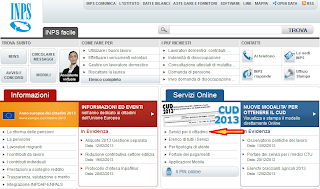
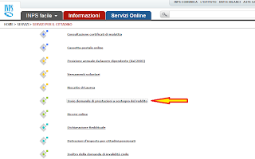
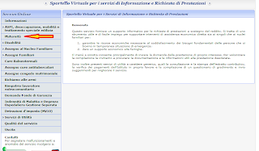
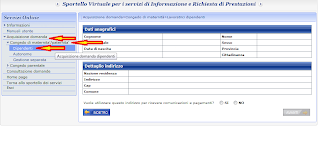
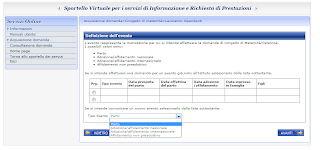
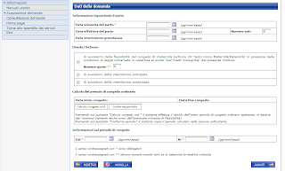

So che non ha niente a che fare con il mio blog, ma siccome mi sono imbattuto, anzi, ho sbattuto, contro il muro della complicatissimo del sito dell'INPS, voglio mettere questa guida che ho trovato in rete per aiutarvi nel caso dobbiate fre richiesta di maternità online.

Per inserire la domanda di maternità obbligatoria dobbiamo essere in possesso del PIN per accedere al sito, vi sconsiglio caldamente di effettuare la richiesta di pin online, nella quale vi vengono inviati a casa i primi 8 caratteri del pin e i rimanenti 8 via sms. Io l'ho fatta e la lettera dell'Inps é arrivata addirittura dopo la nascita di Ginevra! Il pin si può richiedere alla sede inps di competenza e vi viene rilasciato immediatamente, oppure potete accedere ai servizi online tramite la carta regionale dei servizi (crs), ma per questa modalità è necessario il lettore di smart card e il pin della crs che potete richiedere all'ufficio relazioni col pubblico del vostro comune.

**Dovete anche rendere il vostro PIN "dispositivo" e tramite procedura che vi verrà proposta nel momento in cui fate la domanda, dovrete allegare un documento di identità valido e la richiesta firmata.** Io le ho scannerizzate con un programmino per smartphone/iphone Genius scan per velocizzare la procedura.

Una volta scelta la modalità con cui preferite accedere ai servizi, dovete andare al sito [http://www.inps.it](http://www.inps.it/) e cliccare su servizi per il cittadino.

A questo punto vi trovate nel menù dei servizi per l'utente cittadino e dovete selezionare _**Invio Domande di Prestazione a Sostegno del Reddito**._

Ora siete nello sportello virtuale e dovete cliccate su **_Maternità_** nel menù presente alla vostra sinistra.

 Cliccate in sequenza queste voci che si apriranno man mano: _**Acquisizione Domanda** ; **Congedo di maternità/paternità** ; **Dipendenti**._ Ecco ora vi trovate nella vostra scheda personale, in cui sono riportati i vostri dati.

Nella schermata successiva dovete selezionare dal menù a tendina la tipologia di evento per cui state facendo richiesta.

E infine in questa schermata dovete inserire i vostri dati relativi alla maternità. Nella stessa schermata trovate la possibilità d'inserire la data effettiva del parto, questo campo si dovrà compilare per richiedere successivamente la maternità facoltativa, se ne vorrete usufruire.

Non selezionate alcuna delle tre alternative in caso di maternità obbligatoria (2+3).

Successivamente vi verrà chiesto di inserire i dati del neonato e alla fine potrete stampare la ricevuta della domanda appena fatta.
