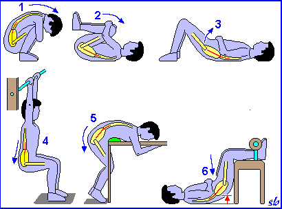

Questo inverno sta durando un bel po' e non se ne può più di andare in bici coperti fino a sopra le orecchie del nostro abbigliamento tecnico. Soprattutto in questi giorni sto soffrendo un po' di mal di schiena, o meglio, non mi sento così elastico come quando facevo esercizi quasi tutti i giorni. Vi allego quindi alcuni esercizi da fare per decompressione discale, un toccasana per quelli come me che soffrono un po' di lordosi lombare. (classico culo in fuori e schiena curvata in dentro).

La METODOLOGIA è simile allo stretching: - 6-8 secondi per andare in allungamento (lentamente); - circa 60 secondi di mantenimento della posizione di massimo allungamento; - 6-8 secondi per tornare alla posizione di partenza (lentamente); - 6-8 serie totali. Gli esercizi con una posizione del corpo parzialmente sollevata e sostenuta da apposito attrezzoprevedono, ove possibile, un tempo unico di allungamento e decompressione di circa 10 minuti. Questi esercizi permettono l'idratazione dei dischi che specie nelle lunghe sedute di allenamento in posizione fisse, sono sottoposte a continua pressione. Abituiamoci anche a tenere posizioni corrette della schiena seduti in ufficio, davanti al pc o semplicemente alla guida. Seduti in ufficio è utile tenere una gamba per volta ad una altezza di 20/30 cm da terra per togliere un po' di pressione alla zona discale e distribuire il carico in modo uniforme. Anche alla guida un cuscino nella zona lombare aiuta a diminuire il carico vertebrale.
