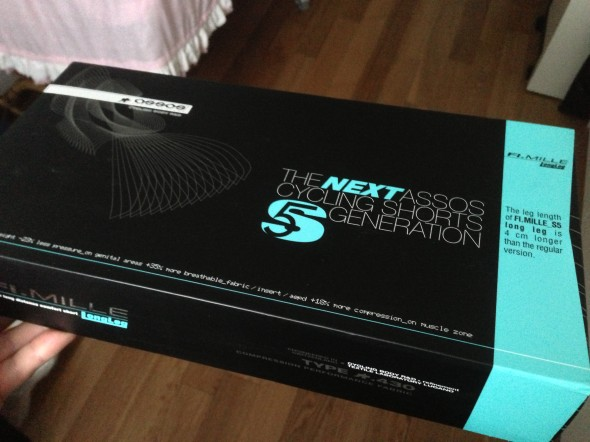
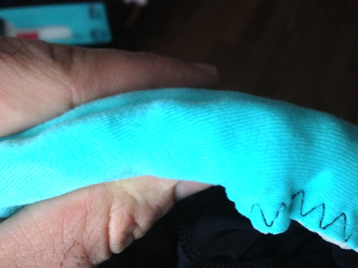
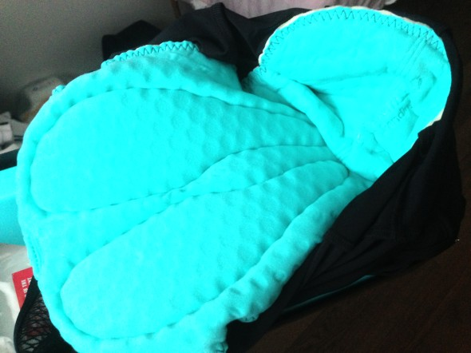
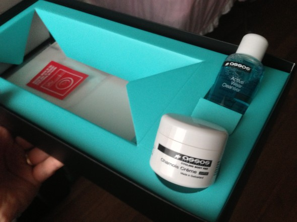

Mi sono arrivati i pantaloncini assos FI mille S5 (versione long leg) ed ho subito notato la qualità costruttiva e dei tessuti. Indossandoli ci sia sente bene fasciati, ma non si avvertono pressioni fastidiose, che alla lunga potrebbero rovinare i nostri giri in bici da corsa.

\[caption id="attachment\_429" align="aligncenter" width="472"\] Assos FI Mille S5\[/caption\]

Ho deciso di prendere la versione mille per essere sicuro di aver preso il modello quasi TOP, dico quasi, perché c'è il modello ancora superiore, ma ha un prezzo folle.

Il fondello è molto spesso, ma sembra molto soffice allo stesso tempo, naturalmente con le dita si perdono i benefici della struttura del fondello stesso. Quando lo di utilizza in bici la pressione delle ossa ischiatiche e del soprasella in generale, viene scaricata uniformemente sulla superficie del fondello.

La zona anteriore svolge una importante funzione di stabilizzazione e protezione delle parti intime per mezzo di una cucitura longitudinale che crea una sorta di conchiglia avvolgente. Davvero un ottimo lavoro.

\[caption id="attachment\_432" align="aligncenter" width="472"\] Assos FI Mille S5\[/caption\]

La versione FI uno S5 differisce dalla versione FI mille S5 proprio per la mancanza di questa zona anteriore, quindi si può dire che anche acquistando la versione base di certo non viene a mancare la comodità nella zona dove conta davvero.

\[caption id="attachment\_431" align="aligncenter" width="472"\] Assos FI Mille S5\[/caption\]

Nella confezione vengono forniti:

una crema da spalmare sul soprasella e dopo ogni lavaggio sul fondello stesso per svolgere una funzione antibatterica;

una campioncino di sapone assos apposito per il lavaggio dei pantaloncini;

una retina dove riporre i pantaloncini (al contrario) durante il lavaggio delicato a 30° .

\[caption id="attachment\_430" align="aligncenter" width="472"\] Assos FI Mille S5\[/caption\]

Avendo le gambe più lunghe in proporzione al corpo, ho preso la versione Long Leg che è 4 cm più lunga della versione regular.

Devvaro un prodotto spettacolare!Voto 10.  Consigliato
