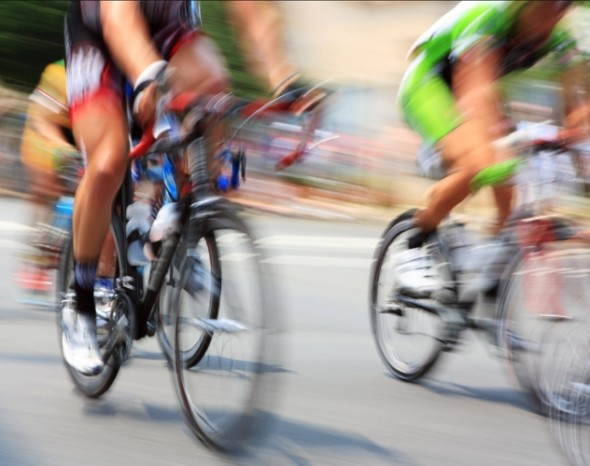

La quota proteica riveste nel ciclista un’importanza pari a quella dei carboidrati, poichè gli amminoacidi giocano un ruolo importante nel metabolismo del muscolo. Agiscono come ricostruttori del catabolismo muscolare da sforzo.

La principale funzione delle proteine della dieta è quella di fornire aminoacidi da utilizzare nei processi di sintesi proteica. Le proteine nell’organismo hanno infatti una funzione strutturale e una piccolissima quota di proteine viene utilizzata a scopo energetico. Nell’organismo ben nutrito il catabolismo proteico contribuisce per solo il 2-5% alla copertura del fabbisogno energetico quotidiano

Nel caso in cui l’apporto calorico sia fortemente carente di substrati energetici (CHO e lipidi) l’organismo si vede costretto a catabolizzare proteine strutturali (muscolo) a scopo energetico

Il catabolismo proteico aumenta solo di poco durante l’esercizio, al contrario la sintesi proteica aumenta marcatamente nel corso di programmi di allenamento sia di resistenza che di potenza

In corso di esercizio l’uso delle proteine come substrato energetico aumenta in soggetti che seguono una dieta povera di carboidrati (l’esercizio avviene in condizione di deplezione o impoverimento delle scorte di glicogeno) .

Questo dimostra l’importanza per l’atleta di una dieta ricca di CHO per il ‘risparmio’ delle proteine muscolari (massa magra)

Per godere buona salute,l’assunzione dei lipidi non deve superare il 30% del contenuto totale di energia nella dieta di cui almeno 70% di grassi insaturi (omega 3, omega 6)

Il bisogno di vitamine e minerali può aumentare durante esercizio strenuo e quindi anche la supplementazione deve essere attentamente valutata in base alla dieta.

In generale sono necessari 0,8 g Kg/Pc/giorno nei sedentari

Negli atleti sono necessari 1,5-2 g Kg/Pc/giorno indipendentemente dal tipo di sport praticato.

Es: triatleta/maratoneta 0,9-1,4gr /Kg/Pc giornalieri di proteine.

 

Ad integrazione vi allego un articolo tratto dal sito **Albanesi**

Le proteine (anche protidi) sono sostanze organiche molto complesse e sono uno dei costituenti fondamentali di tutte le cellule del mondo animale e di quello vegetale. Chimicamente parlando sono dei polimeri (macromolecole costituite da numerosi gruppi molecolari) costituiti da residui aminoacidici che sono uniti tra loro da legami peptidici. Le proteine differiscono fra loro per il numero, la composizione e la sequenza degli aminoacidi che le costituiscono.

Un indice della complessità e della lunghezza delle proteine è dato dal loro elevato peso molecolare che può raggiungere anche il valore di 7.000.000.

Le proteine sono abbondantemente presenti negli organismi viventi, rappresentano infatti più della metà del peso secco di animali e batteri.

Una delle più importanti classificazioni delle proteine è quella che distingue fra proteine semplici e proteine coniugate.

Le proteine vengono dette semplici se sono costituite soltanto da aminoacidi, mentre si parla di proteine coniugate se a esse è legato un gruppo non proteico (detto anche gruppo prostetico); le proteine coniugate possono essere distinte in diverse classi a seconda del tipo di gruppo prostetico. Le diverse tipologie di proteine coniugate sono le seguenti:

glicoproteine

lipoproteine

nucleoproteine

emoproteine

metalloproteine

fosfoproteine

flavoproteine.

Nelle glicoproteine il gruppo prostetico è costituito da glicidi (un esempio è rappresentato dall'alfafetoproteina); nelle lipoproteine il gruppo prostetico è costituito da lipidi (un esempio è il colesterolo LDL), nelle nucleoproteine il gruppo prostetico è rappresentato da un acido nucleico (un esempio è rappresentato dai telomeri), le emoproteine (anche eme proteine) sono proteine contenenti un gruppo prostetico eme (un esempio è rappresentato dall'emoglobina), le metalloproteine sono proteine la cui frazione non proteica è rappresentata da ioni metallici (per esempio la ferritina), le fosfoproteine hanno come gruppo prostetico l'acido fosforico (per esempio la caseina) mentre le flavoproteine hanno come gruppi prostetici i nucleotidi flavinici (un esempio di flavoproteine è rappresentato dai fotorecettori responsabili della sensibilità alla luce blu, ovvero la fototropina 1 e la fototropina 2).

Le proteine sono presenti negli alimenti di origine animale (carne, latte, uova, pesce ecc.) e in quelli di origine vegetale (cereali, leguminose ecc.). Le proteine contengono sempre carbonio, idrogeno, azoto e ossigeno; possono anche contenere ferro, fosforo, rame, zinco e zolfo; l'unità base delle proteine sono gli aminoacidi, di cui sono note venti tipologie; il loro numero genera, con tutte le varie combinazioni, un'enorme varietà di proteine. La sequenza di aminoacidi in una proteina può essere avvolta a elica, essere globulare o combinarsi con più catene assieme: tale costituzione dipende strettamente dalla funzione svolta, distinguendo le proteine in fibrose, globulari ecc.

Gli animali costruiscono le proteine necessarie all'organismo trasformando in aminoacidi le proteine assunte con l'alimentazione, per poi ricombinarli nelle proteine necessarie seguendo le informazioni fornite dal proprio DNA, nella sintesi proteica. Alcuni aminoacidi vengono sintetizzati direttamente dall'organismo. Otto aminoacidi non sono prodotti dal corpo umano e devono essere perciò assunti con l'alimentazione (per tale ragione vengono chiamati aminoacidi essenziali): sono leucina, isoleucina, valina (questi primi tre aminoacidi sono quelli denominati a catena ramificata), lisina, treonina, metionina, fenilalanina, triptofano. Per i bambini risultano essenziali anche arginina e istidina.

Il fabbisogno proteico

 

Le proteine sono molecole fondamentali per il nostro organismo; esse sono presenti nel plasma, nei tessuti, nei muscoli. Intervengono nella definizione del patrimonio genetico, nella sintesi di emoglobina e di mioglobina; la maggior parte degli ormoni e tutti gli enzimi sono di origine proteica. A differenza di quanto accade con carboidrati e lipidi, il corpo non immagazzina scorte proteiche, anche se circa il 15% di esso è costituito da proteine (circa la metà se non si considera l'acqua). Circa il 65% del contenuto proteico è presente nei muscoli. Per l'organismo è di fondamentale importanza il processo con cui (grazie all'impiego delle proteine) si sintetizzano i tessuti e l'equilibrio che si stabilisce fra costruzione (anabolismo) e distruzione (catabolismo) per esempio in seguito a intensa attività fisica. In determinate condizioni l'organismo smonta le proteine contenute nel muscolo per ricavarne energia; se le proteine sono assunte in quantità insufficiente, la fase di costruzione non riesce a ripristinare le perdite muscolari avvenute nella fase catabolica: si avrà pertanto una perdita di massa muscolare. Poiché esiste comunque un limite all'aumento della massa muscolare e il catabolismo proteico aumenta in situazioni di carenza di carboidrati, se si assumono troppe proteine, quelle in eccesso vengono trasformate in grassi di deposito e le scorie sono eliminate come urea con sovraccarico del rene che deve purificare il sangue dall'urea per la sua successiva eliminazione con le urine. Sul fabbisogno proteico di un sedentario c'è un notevole accordo: per un adulto circa 0,83 g di proteine per kg di peso corporeo, secondo la formula FP=0,83\*P.

Le cose cambiano quando si introduce una correzione per l'attività sportiva o lavorativa. Basta pensare che i body builder arrivano anche a quattro volte i valori raccomandati per i sedentari. Non esistono studi scientifici su soggetti in condizioni normali (cioè non sottoposti a trattamenti dopanti) che giustifichino tali aumenti: alcuni studi hanno mostrato che aumentare fino a tre volte la dose proteica giornaliera non ha prodotto nessun miglioramento nelle prestazioni durante allenamenti pesanti. La ricerca più eclatante è quella di Tarnopolski del 1988. Raccogliendo l'azoto espulso con le urine, le feci e il sudore è possibile calcolare l'equilibrio del bilancio proteico; la ricerca prese in esame tre gruppi, sedentari, body builder e atleti di fondo. Il risultato fu che per i body builder, l'integrazione corretta per mantenere l'equilibrio doveva essere di 1,2 g per kg di peso, mentre per gli atleti di fondo di 1,6 g. Ricerche successive indipendenti (cioè non commissionate da fornitori di integratori proteici) hanno confermato gli studi di Tarnopolski, arrivando al massimo a indicare una dose proteica di 2 g per kg in body builder professionisti natural (cioè che non fanno uso di anabolizzanti) e una dose di 1,5 g per kg di peso per l'abituale frequentatore della palestra con allenamento orientato alla forza muscolare. È chiaro che questi risultati possono spiegare come in molti body builder decisamente "cresciuti" non sia l'assunzione proteica a incrementare la massa magra quanto l'assunzione di sostanze anabolizzanti (naturali o meno) che stimolano un'anomala sintesi proteica.

Quante calorie forniscono le proteine? - Quando viene bruciato un grammo di proteine si sviluppano mediamente 5,65 kcal; questo potere energetico però non viene utilizzato completamente dal nostro organismo che non è in grado di sfruttare al massimo l'azoto che le proteine contengono; si ha quindi una riduzione del potere energetico delle proteine che passa da 5,65 a 4,35; dal momento che il nostro organismo assorbe circa il 92% delle proteine che vengono introdotte tramite gli alimenti si può stimare che le proteine forniscano mediamente circa 4 kcal/g.

Le proteine animali vengono assorbite in misura maggiore di quelle vegetali (97% contro il 78%).

**Fonte: www.Albanesi.it**
