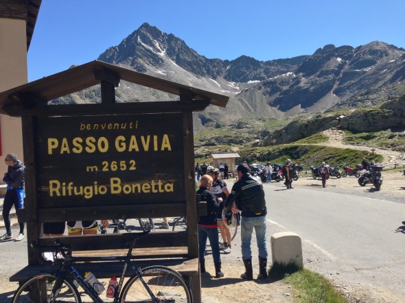
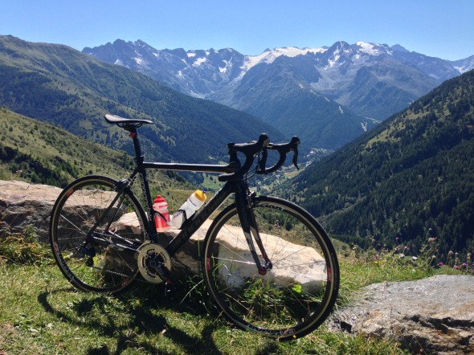
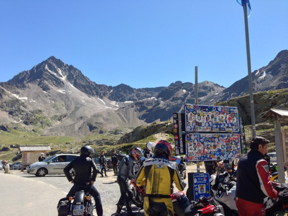
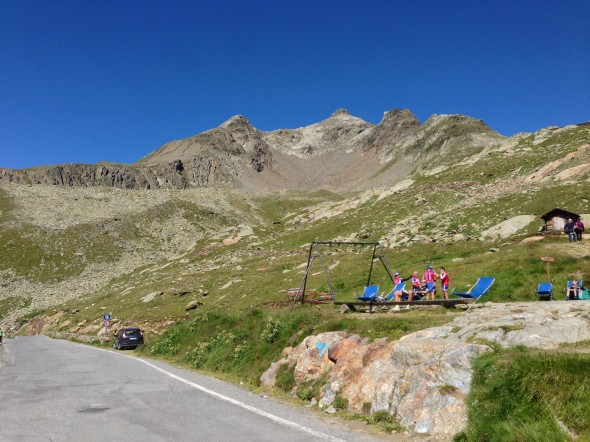

Finalmente ho scalato la salita che sognavo da parecchio tempo, il Gavia, con la sua storia e il paesaggio mozzafiato, quasi lunare. Purtroppo avendo fatto una toccata e fuga non ho potuto abbinarlo al Mortirolo o allo Stelvio, ma già così mi sono divertito. La giornata era spettacolare, nemmeno una piccola nube a rovinare l'azzurro del cielo. Penso che in quelle zone è più unico che raro. Abbiamo lasciato le auto nel parcheggio di una osteria in località Stradolina e per il disagio di aver occupato due posti auto abbiamo prenotato per il pranzo al nostro ritorno. L'osteria poi si è rivelata azzeccatissima, si chiama [Osteria Lissidini](http://www.osterialissidini.it) per chi volesse provare. Insomma eravamo a 5 km circa da Ponte di Legno e ci siamo scaldati lungo la dolce salita che porta ai piedi del Gavia. Purtroppo arrivati in centor ci siamo sbagliati e invece di salire cautamente sul passo, siamo saliti sopra il paese con pendenze dal 10 al 12 %. Poi cisiamo accorti che dovevamo scendere e siamo sbucati nella località sant'apollonia. Da lì siamo saliti ognuno con il proprio passo e non conoscendo la salita, mi sono tenuto sempre in zona 4 bassa con il 34-25. Appena la strada si restringe diventa ad una corsia sola, inizia il tratto duro del Gavia con tratti sopra il 10%, molto spesso al 12% e un tratto brevissimo al 16%. Fatti questi pochi km il più è fatto e la salita diventa più pedalabile, tenendo sempre a mente che si è in alta quota, quindi è sempre meglio non fare sforzi che poi si possono pagare cari. Quando sono arrivato nella buia galleria in prossimità del lago Nero ho capito che era quasi fatta, anche se a causa del buio e per la paura di essere investiti dalle auto e dalle moto, si cerca di accelerare per uscirne al più presto, ma bisogna fare i conti con la pendenza che dovrebbe essere intorno al 9%, insomma una bel calvario. Fuori dalla galleria si vede una serie di tornanti che salgono ripidi circondanti da un paesaggio lunare. Nessuna vegetazione e tante rocce ti fanno capire di essere a 2.500 metri di altitudine. Ora per riempirsi di ossigeno bisogna fare respiri profondi e a bocca spalancata. Alla fine quei tornanti minacciosi si fanno con la consapevolezza di essere agli ultimi 2 km e in breve ci si trova davanti uno spettacolo mozzafiato. Sembrava un sogno, ma era la pura realtà. Sono arrivato sulla cima di Charly Gaul!
