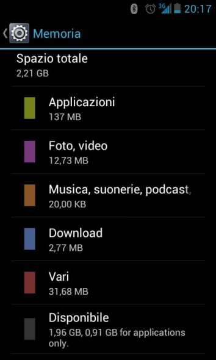
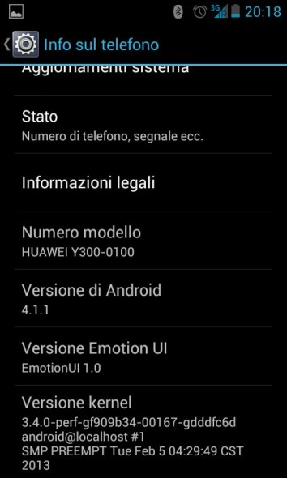

Incuriosito dalle recensioni lette sul web, ho deciso di comprare per mia mamma questo Huawei Ascend Y300 a 129 euro in un centro Wind.

Cercavo un telefono poco costoso, ma che potesse reggere il confronto con altri telefoni più costosi, senza diventare "sorpassato" in pochi mesi.

Penso di avere fatta la scelta giusta.

Chiariamoci, bisogna sempre partire dal presupposto che costa 129 euro !!! non so se mi sono spiegato.

QUALITA' e DESIGN 8: esteticamente è molto carino, ormai i telefoni si assomigliano tutti, però è abbastanza grande e dal design moderno. Non presenta tanti fisici se non il classico tasto on/off e il bilanciere del volume. Gli altri tasti (indietro,home,opzioni) sono touch. Anche il peso di 130 gr è ottimo, non pesa assolutamente nelle mani. Le dimensioni 124,5mm x 63,8mm x 11,2mm. E' presente anche un utilissimo led per essere avvisati senza accendere lo schermo (ulteriore risparmio di energia).

Ho apprezzato tantissimo la parte posteriore della scocca, leggera sì, ma con una superficie ruvida che rende la presa sicura anche con una mano. E' una qualità che dovrebbero avere tutti i telefoni secondo me, essendo un oggetto da tenere in mano l'ergonomia deve essere messa sempre in primo piano. La parte anteriore mi sembra bene fatta e anche il vetro pare essere parecchio resistente. Non è un gorilla glass, quindi una pellicola protettiva è sempre consigliata.

SCHERMO 7: avevo letto che la visibilità dello schermo era il tallone d'Achille di questo smartphone, ma io vado controcorrente e dico che si vede molto bene. Chiaramente sotto la luce del sole è difficile avere una buona lettura dello schermo, ma dubito che si potesse fare meglio con un costo così basso. Sarà che quelle situazioni di controluce io le riscontro solamente in spiaggia, quindi per pochi giorni all'anno si può anche soprassedere su questo "difetto". In condizioni di luce da tutti i giorni la qualità è buona, forse i colori non sono accesissimi, ma piuttosto di avere dei colori finti e sparati come molti altri device, preferisco un colore più tenue, ma reale. Le dimensioni sono 4,0? TFT-LCD, 16M di colori, 800×480 pixel e si tratta di uno schermo capacitivo e multitouch.

FOTOCAMERA 6: la fotocamera è una 5MPX sul retro e 0.3 sul frontale. Non è nulla di eccezionale, diciamo che ci sono obiettivi da 5 mpx migliori, però il suo dovere lo svolge egregiamente. Consiglio di non usare il led flash perchè tende a rendere le foto azzurrate. Peccato per i video che sono a 30 fps, ma non raggiungono i 720 px di risoluzione (480 per la precisione) sarebbe bello se un aggiornamento successivo rendesse i video più dettagliati, ma al momento ci si deve accontentare.

PRESTAZIONI 8: questo è uno dei punti di forza di questo smartphone, che monta un processore Qualcomm di tutto rispetto come l'MSM8225, 1.0 GHz Dual core. Allo stessi prezzo trovate solo quelli a 800mhz o al massimo overcloccati a 1000 mhz, ma non dual core. Riesce a far girare fluidamente niente popò di meno che l'ultima versione di Android Jelly Bean 4.1, quindi una versione che equipaggia solo terminali di fascia alta. Anche facendo eseguire funzioni in maniera veloce e sconfusionata non si notano rallentamenti, soprattutto la navigazione internet è fluida e veloce. Sembra di avere a che fare veramente con un telefono di fascia medio-alta. Con l'utilizzo di internet la zona posteriore tende a surriscaldarsi. La RAM è di 512 Mb e la memoria di 4 gb espandibili a 32 gb con scheda sd.

Il comparto telefonico è di primissimo ordine. Ricezione molto buona e qualità audio in uscita perfetta. Un po' basso il volume del vivavoce e anche la riproduzione della musica. Per video con risoluzione superiore ai 480p si notano delle difficoltà di esecuzione.

BATTERIA 8: anche qui Huawei ci ha voluto stupire fornendo al nostro Ascend Y300 una batteria da 2020 mah che permette tranquillamente di arrivare a fine giornata con un uso intenso di tutte le funzioni disponibile.

Senza dubbio un terminale destinato a spopolare durante l'estate come dimostrano le prenotazioni che ricevono i negozi. Dicono che vanno bruciati prima ancora che arrivano.

Se volete fare il classico acquisto spendendo meno per avere di più, Huawei Anscend Y300 fa proprio al caso vostro.

**Date anche la vostra opinione !!**
