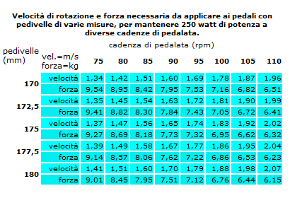

**Questo articolo è tratto dall'ottimo sito [http://www.aegsporting.com](http://www.aegsporting.com/) e non faccio altro che copiare-incollare qui il lavoro di Paolo Alberati.**

Ce lo dicevano da bambini, quando alle prime pedalate fatte in bici da bordo strada ti urlavano <vai agile!> e qualcuno ci aggiungeva pure <…e mangia>. Il motivo di tali raccomandazioni? Nessuno se lo chiedeva: lo facevi e basta.

Lo dicono ancora oggi i vecchi “saggi” del ciclismo, che quando si ragiona di preparazione alle corse basandosi solamente sull’esperienza e non sulla scienza, si raccomandano di iniziare d’inverno <con un mese di agilità. Guai, sino alle feste di Natale, mettere il 53!>. Le ragioni tecniche di questa proposta di allenamento? Non le hanno mai spiegate, ma <così si faceva una volta> e secondo loro così dovremmo fare anche oggi.

Lo raccontava qualche tempo fa anche “Il” grande saggio del ciclismo italiano, Alfredo Martini: <il “rapportone” è come una cambiale: tu usalo pure, ma prima o poi la paghi!>

Lo ripetono continuamente in televisione i commentatori delle corse professionistiche, Davide Cassani in testa: <quell’atleta lì se aumentasse la sua cadenza media di pedalata in salita di almeno 15 rpm, avrebbe dei grandi margini di miglioramento>.

La verità è poi però che continuiamo a vedere atleti vincere, pur spingendo rapporti lunghissimi.

Dove sta dunque la verità? Quali sono i motivi tecnici per cui uno dovrebbe scegliere di pedalare agile oppure duro?

 

IL CONTRIBUTO DELLA SCIENZA E DI UNA EQUIPE MOLTO PREPARATA

Una risposta molto chiara e tecnicamente ineccepibile riesce a darla, anche con illustrazioni illuminanti, il prof. Mattia Michelusi nel volume OBIETTIVI, TIPOLOGIE E MEZZI DI ALLENAMENTO NEL CICLISMO MODERNO (Casa editrice Calzetti e Mariucci 2013), scritto in collaborazione con alcuni tecnici (tutti molto giovani e molto bravi) di ciclismo, coordinati dal prof. Fabrizio Tacchino, direttore responsabile del Coach Team Assistant (www.coachreality.blogspot.it), nostra vecchia conoscenza in quanto nel Girobio – Giro ciclistico d’Italia Under 27 da noi organizzato dal 2009 è stato per due anni coordinatore dello Staff Scientifico che seguiva gli atleti in gara.

 

\[caption id="" align="aligncenter" width="449"\] OBIETTIVI, TIPOLOGIE E MEZZI DI ALLENAMENTO NEL CICLISMO MODERNO\[/caption\]

 

Una premessa d’obbligo: tutto ciò che vi diremo, possiamo dimostrarvi che ha valenza scientifica grazie al fatto che a fine anni ’80 è stato inventato il misuratore di potenza (in origine il famoso SRM (www.srm.de), oggi disponibile anche sotto altre forme, conosciute come POWERTAP (www.powertap.com) o per esempio il nuovissimo GARMIN VECTOR (http://sites.garmin.com/vector/?lang=it&country=IT) il quale oggi ci consente di misurare ogni tipo di gesto pedalato e ricavarne parametri, valori, potenzialità, grazie alla possibilità di scaricare grafici sul nostro computer. Cosa che non era possibile ai famosi “vecchi saggi”, che pur senza strumenti tecnici, con l’intuito avevano già capito molto, se non tutto del gesto pedalato.

 

COSA SONO LA FORZA E LA POTENZA?

Innanzitutto partiamo da due definizioni che ci sono indispensabili per svelare il nostro rebus sulla convenienza dell’andare agili o duri sui pedali.

Cos’è la FORZA? La forza muscolare è quella capacità motoria che permette di vincere una resistenza (per esempio la resistenza della catena che, agganciata agli ingranaggi della guarnitura, non vorrebbe farci abbassare la pedivella verso il basso...) ed a questa si oppone tramite la tensione di una parte della muscolatura. Nel nostro caso, in gran parte, della muscolatura delle gambe (ovviamente coadiuvata dalla schiena, glutei, busto in genere, ma in parte minore).

Come viene erogata da noi che pedaliamo?

Semplice, coniugando una forza (N) di spinta (da parte della gamba+scarpa che “pigia” sul pedale) applicata ad una leva (m) ossia la pedivella. In particolare dovremo parlare di una coppia di forza ove la risultante FORZA verrà ricavata moltiplicando N x m.

Quindi se per esempio un ciclista applica al pedale una forza equivalente a 300 Newton (qui torna in gioco il famoso Misuratore di Potenza che misura questa spinta) con una pedivella lunga 175 mm, la coppia risultante è pari a 52,5 Nm (Newton metro)

 

300 N (Newton) x 0,175 m (metri) = 52,5 Nm (Newton metro)

 

Da ciò deriva che riducendo la lunghezza della pedivella la coppia (ossia l’espressione della Forza) si riduce e viceversa allungandola.

Detto questo però, non semplifichiamo troppo, in quanto verrebbe da dire: <allunghiamo tutti la pedivella, per esempio, a 180 mm ed otterremo maggior una coppia risultante maggiore>!

Non funziona esattamente così, perché in verità ogni lunghezza di gamba, o meglio di “cavallo” necessita di una sua lunghezza di pedivella. Ce lo dimostra la tabella sottostante.

 

 

 

\[caption id="" align="aligncenter" width="595"\] pedivelle cavallo\[/caption\]

Cos’è la POTENZA? La potenza, la cui unità di misura sono i “famosi” WATT (sintetizziamo molto, ma andiamo subito al succo) è la risultante dell’interazione tra la forza applicata al pedale e la velocità con cui lo stesso si muove, ovvero gira, ossia la cadenza di pedalata, che abbrevieremo d’ora in poi in RPM (rotazioni per minuto).

 

POTENZA (in watt) = FORZA (in Newton) x CADENZA di PEDALATA (in Rpm)

 

Sintetizziamo, dicevamo, perché la formula con cui si arriva a questa risultante è piuttosto complessa, e vi rimandiamo semmai alla lettura dell’interessantissimo testo di cui vi abbiamo poco fa parlato, in particolare a pagina 72, ma insomma se ci interessa capire se è conveniente andare agile piuttosto che spingere rapporti duri, a noi in questa sede basta capire cosa siano la forza e la potenza e giungere a questo punto ad una conclusione logica, che ci viene stimolata dai due grafici sottostanti.

 

LEGGIAMO I GRAFICI SRM

I grafici che riportiamo sotto, estrapolati dal testo del prof. Tacchino, mostrano le risultanze della rilevazione del misuratore SRM montato sulla bici di un atleta impegnato in una partenza da fermo, con i dati scaricati sul computer.

 

Il primo grafico, quello indicato dalla figura 3.8 mostra che quando l’atleta parte “a tutta” al secondo zero, in un primo istante eroga una forza (N) molto alta di 1062 Newton, lo fa ad una cadenza di pedalata RPM bassissima (sulle 40 Rpm) ed eroga “solo” 778 WATT di potenza. Poi man mano che passano i secondi e l’atleta continuando a spingere sui pedali alza la sua cadenza di pedalata, contestualmente si alzano anche i WATT erogati (ricordate? WATT = FORZA x RPM), ma in maniera inversamente proporzionale si abbassa anche la forza erogata!

 

 

\[caption id="" align="aligncenter" width="902"\] watt - forza\[/caption\]

 

\[caption id="" align="aligncenter" width="955"\] rapporto cadenza potenza\[/caption\]

Questo cosa significa?

Molto semplice: se vuoi aumentare la potenza che eroghi in WATT, devi aumentare la cadenza di pedalata in RPM. Ma non solo: fare questo, ti garantisce anche di risparmiare Forza erogata in NEWTON!

Il grafico della figura 3.9 dimostra questo risultato in maniera ancor più schematica: all’aumentare della cadenza di pedalata (nella ascissa – X) aumentano i WATT (nell’ordinata Y) e si riduce la forza spesa in Newton.

 

LE CONCLUSIONI A NOI TANTO UTILI…

A questo punto andiamo al sodo, alle conclusioni che a noi servono.

Se io mi trovo in salita a ruota di un compagno di pedalata che per seguirlo mi costringe a spingere a 300 watt per mantenere la sua scia (potremmo anche dire, per esempio, che mi richiede di pedalare a 20 km/h) posso scegliere di erogare quei watt o di tenere quella velocità con il rapporto che preferisco.

Se posseggo il misuratore di potenza posso però verificare con certezza scientifica che se spingo ad esempio con una cadenza agile (diciamo 85 rpm) per mantenere i 300 watt e i 20 km/h consumo molta meno forza (Newton) di quella che mi serve per mantenere la stessa velocità e watt ma magari con 45 Rpm!

 

Facciamo un altro esempio.

Se dotato sempre di misuratore di potenza volessi decidere di mantenere nell’arco della scalata valori di forza (Newton) costanti, potrei decidere di farlo sia con 40 che con 85 rpm, solo che se volessi esprimere per esempio 300 Newton costanti con 40 RPM erogherei non più di 300 watt e andrei non più che a 20 km/h, se invece decidessi, a parità di forza (Newton) di aumentare la cadenza di pedalata in Rpm alleggerendo il rapporto, otterrei un aumento rapidissimo dei Watt erogati e della velocità di crociera.

 

Quindi a parità di velocità e di prestazione misurabile in watt: CONVIENE ANDARE PIU’AGILI!

Perché ci si stanca di meno. Perché si dura di più nel tempo. Perché si intossica meno la muscolatura. E perché, infine, si ottengono risultati sportivi molto migliori!

 

 

Ora va tenuto in considerazione che gli eccessi non giovano mai, perché se per esempio è vero che pedalando duro (per esempio a 40 Rpm) la tensione muscolare è più duratura e ciò "costringe" i vasi sanguigni riducendo il flusso sanguigno ai tessuti, è anche vero che pedalando troppo agile (per esempio a 130 Rpm) il muscolo aumenta in maniera esponenziale il consumo di ossigeno, esponendo il pedalatore nel breve tempo ad un esubero di tossine muscolari ed a lungo andare a possibile anemia. Dunque come dicevano i latini <in medio stat virtus>, è nell'equilibrio che si trova la soluzione, ove è anche vero che ciascuno di noi ha caratteristiche muscolari diverse (fibre rosse lente, fibre bianche veloci etc), ma detto tutto questo quali sono le candenze di pedalata da tenere in allenamento/gara?

Dunque in PIANURA una velocità di cadenza (RPM) ideale è quella superiore alle 85, ma sotto le 105 rpm.

Mentre in SALITA si è visto che è conveniente star un po' più "duri", dalle 75 alle 95 Rpm la cadenza perfetta.

A tutto questo fanno eccezione ovviamente le sedute di allenamento specifico, ove di proposito si vanno ad allenare anche gli estremi (molto duro e molto agile) proprio perchè così facendo si cerca di aumentare le capacità prestative del muscolo e le prove su PISTA ed a CRONOMETRO ove si usano parametri diversi.

 

Vi regaliamo infine, a conclusione della nostra esposizione, un grafico molto utile ed esplicativo. Augurandovi buone pedalate... agili!

 

\[caption id="" align="aligncenter" width="410"\] cadenza di pedalata\[/caption\]

Paolo Alberati
