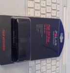
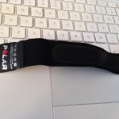
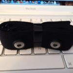
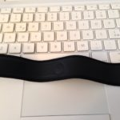

Se cercate una fascia cardio compatibile garmin polar, questa è sicuramente la più semplice, economica e affidabile

Dopo l'ennesimo allenamento svolto con la fascia cardio premium del garmin 500 che segnava valori spesso sopra i 200 battiti, ho deciso di fare il grande passo e prendere la fascia del polar da 20 euro (e di sostituire la batteria del sensore - codice CR2032).

La fascia è molto semplice e morbida; si fissa il sensore del garmin ed è pronta all'uso.

La qualità dei materiali sembra superiore a quella del garmin, soprattutto la zona gommosa dei sensori. Per il resto è una è una normalissima fascia morbida da indossare e molto comoda.

  
Dopo alcuni utilizzi la fascia cardio compatibile garmin si è dimostrata subito precisa e costante nelle rilevazioni. Non ci sono sbalzi ingiustificati nei battiti, ma crescono o decrescono progressivamente all'aumentare o diminuire dello sforzo.

Mi sembra costruita meglio della fascia garmin, perchè quest'ultima tende con il tempo a rovinarsi nella zona dei sensori che vanno a contatto con la pelle, perchè non si tratta di una zona elastica. Quindi tira e molla poi il danno diventa irreparabile.

Consiglio dopo ogni utilizzo di immergere la fascia (senza il sensore) per un'oretta in acqua calda e napisan per disinfettarla e rimuovere i sali del sudore, mentre una volta alla settimana si può mettere anche in lavatrice a 30°.

Potete acquistare la fascia cardio compatibile garmin qui su [Amazon](https://amzn.to/2TQ8kHn)

#### Alternative

Ho notato su Amazon che esiste una versione aggiornata della fascia cardio che ho recensito. La struttura è completamente diversa e utilizza più materiale plastico. Sinceramente ve la sconsiglio perchè c'è il fatto che la plastica sia incollata al tessuto, alla lunga non promette una durata assicurata. Vi metto lo stesso il link per correttezza, ma ripeto, non la consiglio [Polar Pro Chest Strap Fascia Toracica](https://amzn.to/2CyFQar)
