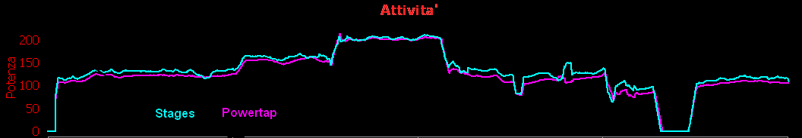

Finalmente è arrivato anche il misuratore di potenza Stages e dopo 4 settimane dall'ordine sono andato a ritirarlo presso il negozio "El Coridor". Sveglia presto per essere là prima dell'orario di apertura.

Torno a casa baldanzoso e via subito in cantina ad installare il nuovo giocattolo. Il tempo di installazione in sé è di circa 2 minuti. Si toglie il pedale, si svita la brugola della pedivella sinistra, si sostituisce con quella dello Stages, si avvita la pedivella e poi si rimette il pedale. Più facile di così... Io ho preso la versione FSA per BB30 in alluminio in quanto ho la guarnitura FSA SL-K in carbonio e non volevo perdere il BB30 mettendo adattatori. E' anche la versione più economica. Purtroppo questa soluzione vanifica il vantaggio di peso dello Stages che è dato per 20 grammi, in quanto la mia pedivella in carbonio pesa 140 grammi, mentre la pedivella con lo Stages ne pesa 240. Al netto del misuratore quindi ci ho rimesso 80 grammi.... pazienza, mangerò meno pasta. Se avessi messo la guarnitura ultegra, con adattatori ecc avrei sicuramente peggiorato di altro peso, oltre ad essere una soluzione molto più dispendiosa. Una volta installato, si tira la linguetta gialla, si apre lo sportellino della batteria e poi va reinserita. A questo punto ci si può connettere con un Iphone mediante bluetooth 4 e l'applicazione Stages Cycling ci permetterà di aggiornare il firmware, nel caso ce ne sia bisogno. Tutto molto semplice. Subito ho fatto un test comparativo sui rulli, avendo la ruota posteriore con Powertap SL+. Al powertap ho abbinato il garmin 500, mentre lo stages era connesso al mio iphone con l'ottima applicazione Wahoo, che è l'unica o una delle poche che supporta lo stages permettendone la calibrazione. (con strava non è possibile). Appena connesso lo stages ho provveduto alla calibrazione tenendo la pedivella a ore 6, verso il basso e la bici appoggiata al muro. Dalle prime pedalate ho notato subito che lo stages misurava circa 7/10 watt in più rispetto al powertap e subito mi sono venute le paranoie sul fatto che misurando una sola gamba e moltiplicando la potenza x2, potrebbe essere che abbia uno sbilanciamento 53/47% rispettivamente sx/dx. Infatti inttorno ai 130 watt del powertap, lo stages segnava circa 138 watt. (130 x53% x2 = 138). Cercavo allora di allentare la spinta sul pedale sinistro per aumentare la spinta su quello destro e facendo così i valori sui 2 dispositivi erano vicinissimi, però si trattava di una situazione innaturale. La cadenza era superiore ai 90 rpm. Stavo chiaramente "barando" e sicuramente la pedalata non era redditizia svolta in quel modo. Appena ho aumentato la potenza ecco che i valori sono diventati praticamente identici tra i due misuratori, questo ad indicare che ho una spinta uniforme 50/50% non appena diminuisce la cadenza e aumentano i wattaggi. Come si può vedere dal grafico che ho allegato, dove si vedono le piccole parti che misurano la stessa potenza è laddove diminuivo intenzionalmente la potenza sul pedale sinistro, mentre c'è una parte di alcuni minuti dove la potenza è più alta e le potenze si sovrappongono. (la linea di colore ciano è lo Stages)

Prossimamente vorrei fare un test più lungo e in strada, ma già così mi ritengo soddisfattissimo dello Stages.

Chiaramente ci sono misuratori sul mercato più precisi grazie alla misurazione sx/dx, ma a questo prezzo non c'è niente di meglio, diciamo che in questa fascia di prezzo Stages Cycling non avrà concorrenza, supportato anche dal fattore peso che anche in MTB farà la differenza. E poi bisogna ricordare che l'importante è la ripetibilità del dato, cioè i 200 watt fatti oggi in determinate condizioni, devono essere i 200 watt fatti tra 1 anno. Solo un dispositivo con queste caratteristiche può considerarsi un misuratore di potenza affidabile. Consiglio per l'analisi degli allenamenti e per crearsi una propria banca dati il software gratuito Golden Cheetah. Oltre ad essere sviluppato più che giornalmente, ogni utente da il suo contributo per migliorarlo.
