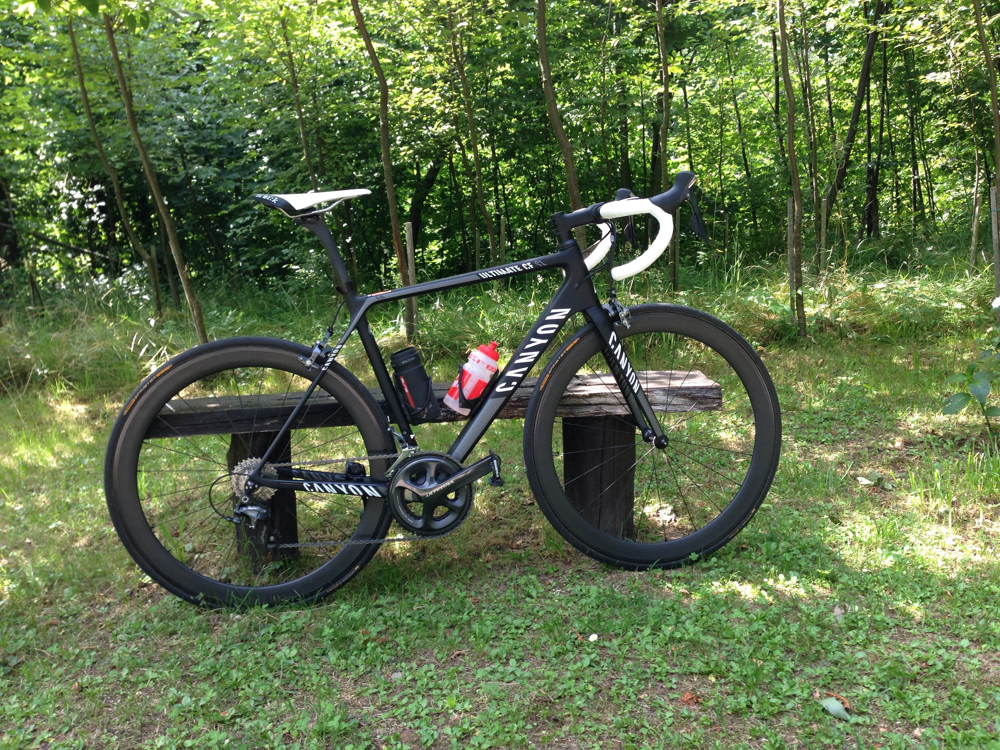

E' passato un po' di tempo dall'uscita di questo modello, fratello minore del più blasonato SLX. La differenza tra i due telai è principalmente nel peso, quindi ipotizzo che sono state utilizzate delle differenti fibre di carbonio. Mentre le forcelle sono le medesime.

La nota positiva è senza dubbio la geometria Sport, che pur mantendo una linea racing, permette di avere stack e reach superiori rispetto ai telai della concorrenza.

Per avere geometrie simili bisogna andare sui modelli "gran turismo" che ormai ogni casa mette a disposizione, ma spesso si tratta di telai esteticamente meno aggressivi. Anche se non mancano quelli fatti veramente bene tipo Scott Solace e Trek Domane per citarne un paio.

La qualità dei materiali mi ha veramente stupito, vendendo da una Cannondale che in realtà mi ha deluso sotto questo punto di vista. Le rifiniture sono molto ricercate e conferiscono alla bicicletta un certo senso di robustezza misto a raffinatezza. Mi ha impressionato lo stem che ricorda molto il ritchey superlogic o il Pro, quado in realtà si tratta di un modello fatto in casa Canyon.

Lo stesso dicasi del reggisella VCLS, senza tanti fronzoli, ma esteticamente accattivante, sulla falsa riga del FSA. Inutile dire che lo smorzamento delle vibrazioni è fantastico.

La serie sterzo è la comodissima Acros che si regola facilmente con un piccolo cacciavitino lateralmente, chiudendo una piccola vite che genera pressione tra stem e cuscinetto sterzo.

Anche la piega manubrio è stata rivista e presenza uno schiacciamento nella zona dell'impugnatura in presa alta. Davvero notevole.

Il telaio è fantastico, sia esteticamente, ma de gustibus, sia nella guida. Sinceramente me lo aspettavo più rigido nella zona sterzo, ma a confronto con il mio supersix mi sembra meno rigido. Questo però conferisce una maggior sicurezza sull'anteriore, infatti permette di correggere maggiormente la traiettoria in curva, senza compromettere la sicurezza. Forse tutto questo dipende anche dalla ottima e leggera forcella derivante dalla SLX. Un capolavoro!

Il resto del telaio mi sembra sufficientemente rigido e questo lo si può testare facilmente mettendo la bici sui rulli, in piedi sui pedali non si avverte alcun molleggiamento del telaio.

Il passaggio dei cavi è interno e realizzato bene, anche se l'ingresso cavi nel tubo obliquo poteva essere fatto meglio, sembra un foro fatto con il trapano insomma.

Per il gruppo mi sono affidato allo stra collaudato ultegra che nella versione 11 velocità ha raggiunto una velocità e una leggerezza di cambiata da rimanere a bocca aperta. Rispetto al modello precedente si nota subito la differenza sul deragliatore anteriore. Un piccolo gesto sulla leva e la corona sale dal 36 al 50 e anche sulla corona grande ci sono 2 microaggiustamenti come sulla corona piccola.

Anche esteticamente la guarnitura ha fatto un grande passo in avanti, soprattutto dal lato pratico. Ora si possono cambiare le corone senza difficoltà, passando dal 50 al 53, dal 34 al 36 senza problemi di compatibilità. Si possono addirittura installare le rotor.

Le ruote in dotazione sono le inossidabili Mavic Elite S, hanno un buon peso, e una robustezza degna di nota. Permettono frenate al limite senza pensieri.

Le ho sostituite con una paio di tubolari in carbonio da 50mm e la differenza si fa notare. Nei rilanci la bicicletta è più reattiva e nelle salite da fare a bomba questo di traduce sicuramente in un vantaggio.

Insomma sono davvero soddisfatto del mezzo e Canyon non mi ha deluso. Ora è uscito il modello nuovo della ultimate cf slx e la cosa che si nota subito è l'abbandono della geometria sport, quindi sono contento di aver acquistato questo telaio prima che ritornino le bici lunghe e con serie sterzo basse. Purtroppo la mia schiena è da impiegato, non da professionista.
