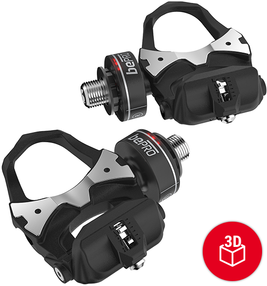
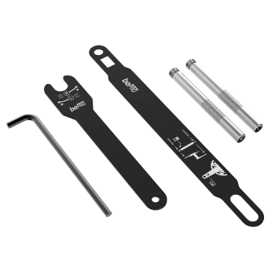
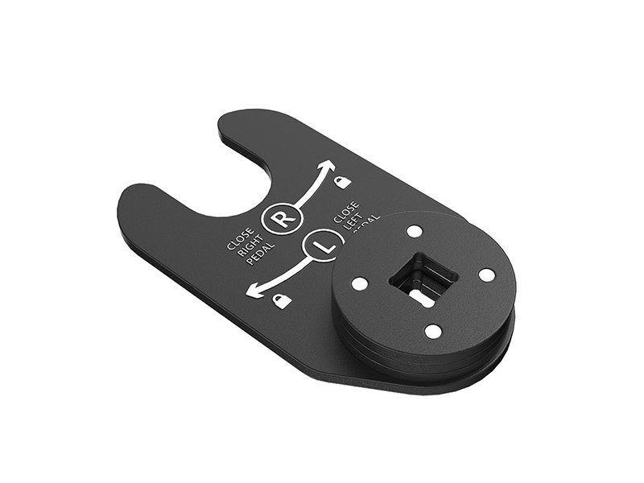
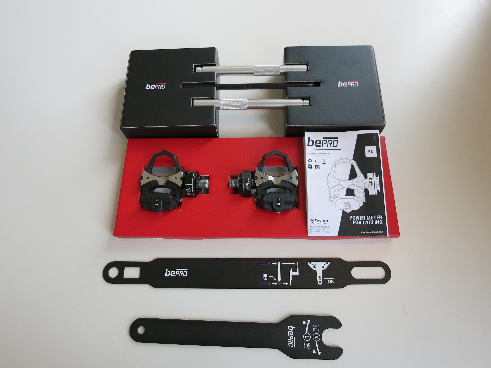
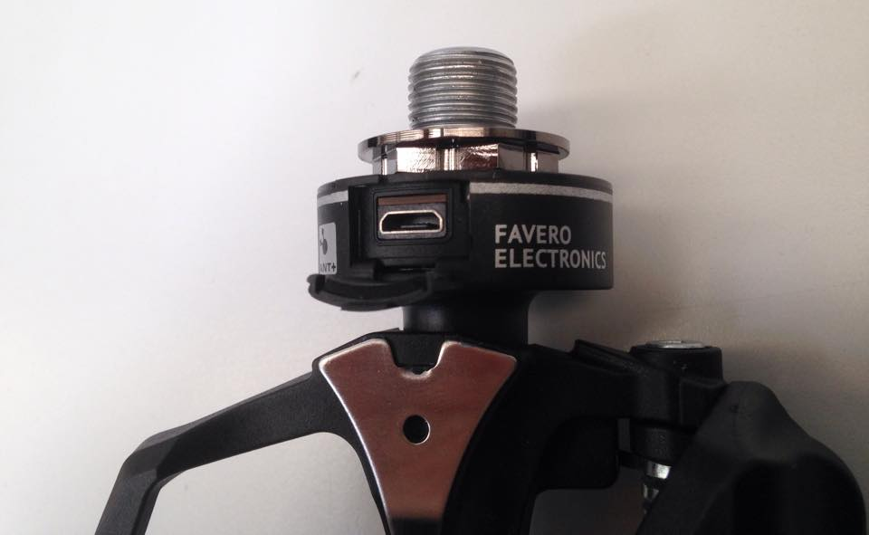
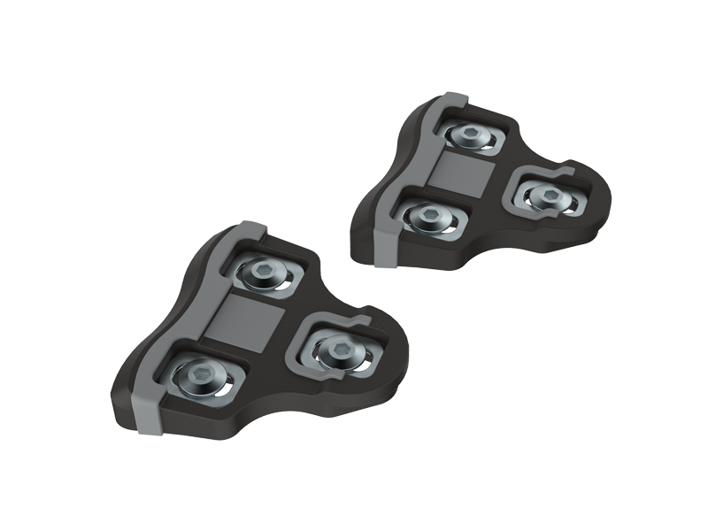
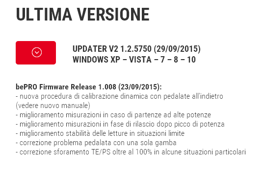

E' entrato in scena quasi in punta di piedi nel mercato mondiale il nuovo misuratore di potenza italiano BePro di Favero, un azienda del Trevigiano. Si tratta di un misuratore installato sui due pedali oppure su uno solo (come il Vector S), ad ogni modo il funzionamento è uguale, solamente che il doppio pedale somma la potenza dei singoli misuratori, mentre il singolo pedale raddoppia la potenza della gamba nel lato in cui viene installato. Nella confezione del singolo misuratore è compreso il pedale opposto.  Questo comporta ormai il risaputo "difetto" di fare una misurazione che dipende dal bilanciamento degli arti inferiori. Non tutti pedaliamo 50%-50% e sopratutto a varie intensità di sforzo questo bilanciamento può variare. Poco importa, l'importante è la ripetibilità della misurazione. I due aspetti che rendono questo dispositivo molto allettante e potenzialmente pericoloso per la concorrenza sono sicuramente il prezzo da una parte: 499 il singolo, 749 il doppio; dall'altra parte la semplicissima installazione a prova di imbranato. Grazie a delle specie di dime/adesivi e alle chiavi in dotazione è possibile effettuare una installazione con una bassissima probabilità di commettere errori di serraggio. Quindi la chiave dinamometrica non è necessaria come per altri misuratori.    L'unita à dotata di una porta microUSB per effettuare le ricariche, con relativo sportellino in gomma per evitare che sporco e acqua possano entrare.  Il pod è immerso in una speciale resina, quindi l'involucro che si vede è appositamente studiato per resistere a tutti i tipi di maltrattamento (o almeno si spera). La modalità di comunicazione avviene solamente tramite ANT+ e al momento non è prevista l'opzione Bluetooth a basso consumo energetico, ormai in voga grazie al diffondersi delle applicazione sportive per smartphone. Questo possiamo considerarlo sicuramente una mancanza, ma a volte la semplicità rende un dispositivo meno soggetto a problematiche. Posso portare dell'esempio dello Stages che per i primi mesi ha sofferto di drain-battery dovuto al non spegnimento del bluetooth durante lo stand-by. Le tacchette sono compatibili con le Keo originali, quindi nessun problema. Altra nota positiva la possibilità di scegliere il pedale equipaggiato con il sensore, lato destro o sinistro, credo più per una questione di comodità personale che per una questione di funzionamento.  Anche se c'è da dire che se si sceglierà di misurare la gamba su cui la potenza è bilanciata maggiormente si rischia una sovrastima dei dati. Nel caso contrario avremo una sottostima dei dati. Problema risolto con l'utilizzo dei 2 sensori su ambo i lati. Anzi in questo caso avremo anche la possibilità di rilevare l'efficienza della pedalata. Il vantaggio di avere il misuratore sui pedali è sicuramente il poterli spostare da una bici all'altra senza modifiche o impedimenti dovuti all'incompatibilità. Dall'altra parte sono più esposti ad eventuali cadute, ma tutto sommato nello shop sono presenti tutti i pezzi di ricambio. Il peso del corpo pedale più pod è di 150 grammi circa, un vero record se pensiamo che un pedale look keo pesa pochissimi grammi in meno, circa 125 gr. Le specifiche di Favero danno come autonomia 30 ore che equivalgono circa a 7 uscite lunghe, non male direi.

Per la qualità delle misurazioni non posso al momento scrivere nulla, speriamo in futuro di poterli provare.

Ho saputo che è uscito un aggiornamento firmware dei pedali, o meglio un aggiornamento del software che perette di aggiornare facilmente i pedali e allo stesso tempo impostare dei settaggi più o meno importanti. Ad esempio si possono impostare la lunghezza delle pedivelle, parametro importantissimo, il funzionamento dei led e non ultimo si può impostare una correzione sulla lettura della potenza (utile nel caso ci possano essere delle stime sballate a causa dell'utilizzo delle corone ovali) Ultima chicca, l'impostazione "shipping mode" una modalità di risparmio energetico utilizzabile sia per la spedizione e lo stoccaggio del prodotto presso i dealer, sia nel caso si preveda di non utilizzare la bicicletta per parecchio tempo.

Sono molto fiero di questo prodotto primo perchè è made in Italy e poi perchè l'azienda è nella mia Treviso.
