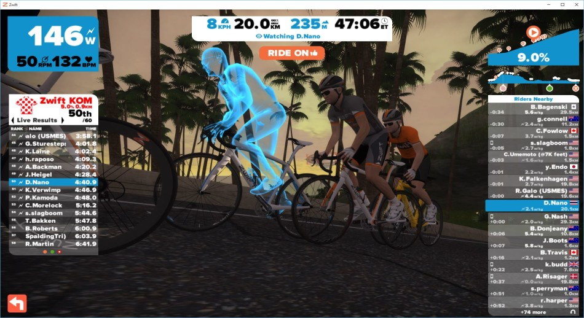
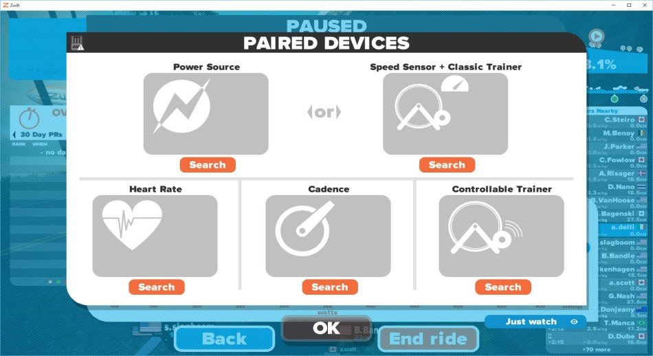
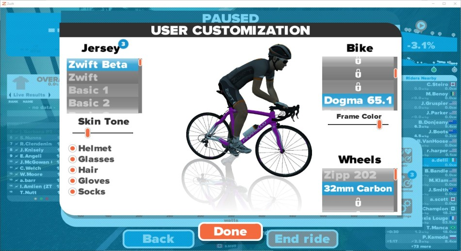
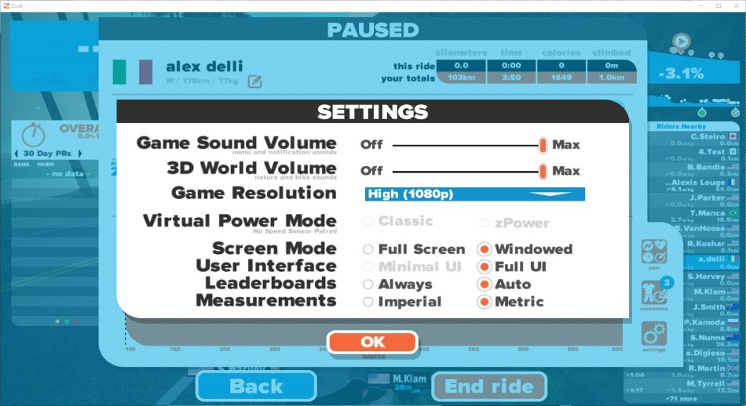
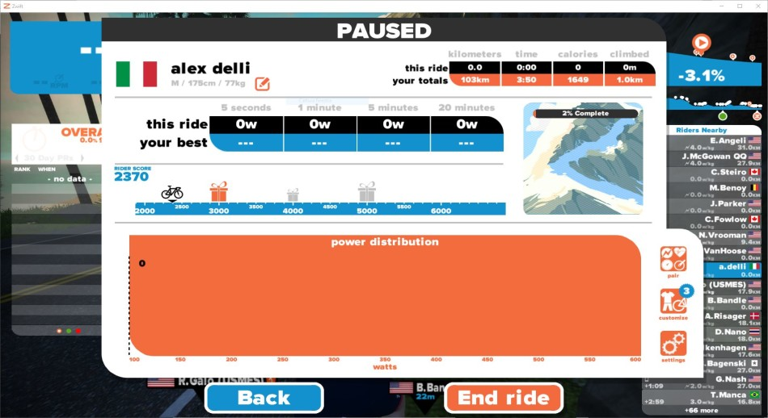
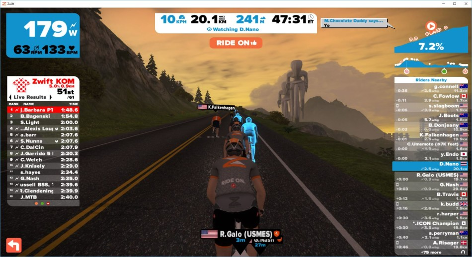
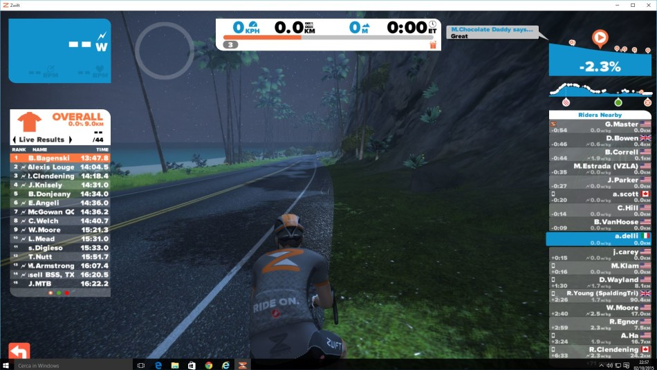
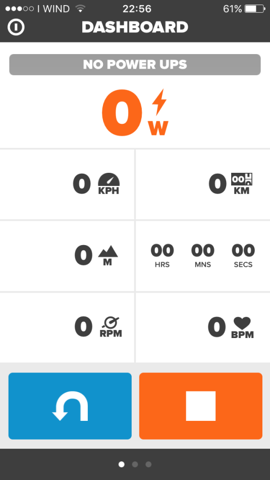
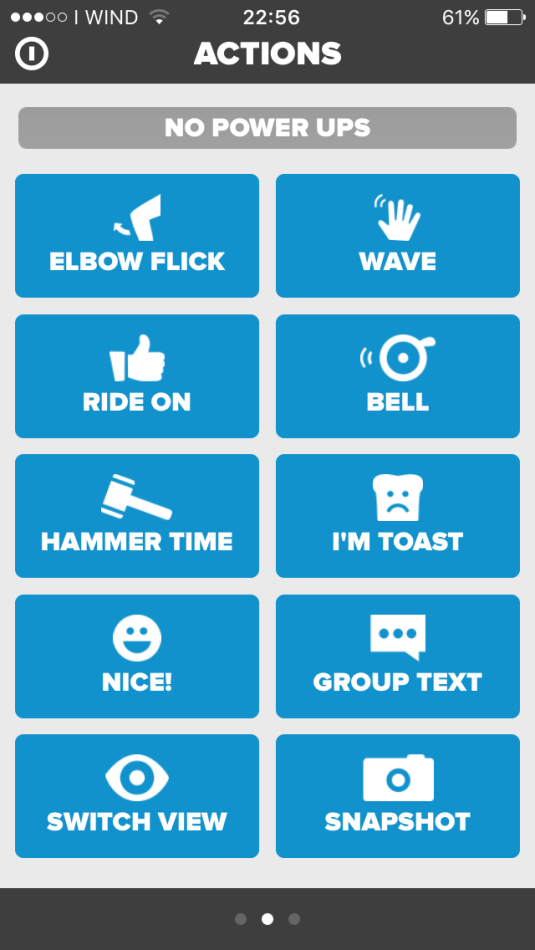
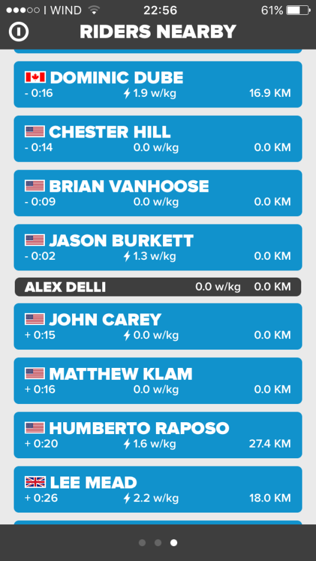

La piattaforma che più ha rivoluzionato il modo di allenarsi sui rulli è entrata nell'ultimo mese della fase di test iniziata ormai un anno fa. Il team di Zwift ha emesso un comunicato dove si ringraziano tutti gli utenti che hanno aiutato nello sviluppo del software mediante la segnalazione dei bugs, e si avvisa che dal prossimo mese il servizio sarà a pagamento. 

Ancora non ci sono i prezzi ufficiali, si parla di una paio di cappuccini al mese, quindi saremo nell'ordine dei 5 euro mensili, che secondo me sono più che giustificati considerando la quantità di riders presenti, ma soprattutto il divertimento di questo, passatemi il termine "videogioco". Anche guardando in giro alla concorrenza non ci sono altre piattaforme così popolate. Chiaramente ci sarà una diminuzione fisiologica di utenza quando si passerà a pagamento, ma non sono così convinto che ci sarà una significativa diminuzione degli iscritti. Zwift per ringraziare chi ha partecipato alla demo, metterà a disposizione uno specifico equipaggiamento per rendersi riconoscibili come "quelli che c'erano dal primo giorno". Veramente apprezzabile (anche se avrei preferito uno sconto sulla quota di iscrizione). Per chi non lo conoscesse, Zwift è un vero e proprio simulatore in 3D con cui si può interagire con un qualsiasi rullo da bici. Se non abbiamo rulli di ultima generazione possiamo utilizzare la potenza virtuale che il software calcolerà mediante degli specifici algoritmi, quindi tenendo conto di peso, altezza, resistenza aerodinamica, resistenza al rotolamento e resistenza del rullo stesso. Se invece siamo felici possessori di smart trainer, dotati di sensori ANT+ o bluetooth ecco che possiamo sfruttare appieno le potenzialità di questo software.

 Una volta connessi i vari dispositivi, operazione veramente semplice e intuitiva, si passa a configurare il proprio avatar equipaggiandolo come più ci pare, o quasi. Terminata la vestizione ci si ritrova con la propria bici in strada sulla fantasiosa isola di Watopia in località sconosciuta. A dire il vero in concomitanza con i mondiali di Richmond si alternava una settimana sul percorso del mondiale a una sulla nota Watopia.

 Dopo le prime pedalate possiamo decidere se percorrere il nostro circuito da soli oppure aggregarci ai corridori che raggiungiamo o che ci sfileranno. Questo non è un dettaglio da sottovalutare, perchè stando in scia ad un altro corridore, a parità di sforzo si produrranno più watt, quindi diminuendo lo sforzo si manterrà la stessa velocità. Il percorso è molto vario e si passa dai lunghi tratti in pianura, a tratti in salita abbastanza impegnativa, anche se non dura più di tanti minuti. Possiamo definirlo più un percorso collinare che di montagna.

 Possiamo anche percorrere il circuito in senso in verso, infatti non è raro vedere sfrecciare dalla parte opposta della strada gruppi di pazzi che scendono a 60 km/h mentre noi stiamo faticando in salita a 50 rpm. Io personalmente sono connesso con un TACX Vortex Smart collegato al PC mediante chiavetta ANT+ e connesso all'Iphone mediante applicazione Zwift via rete wireless. E' più complicato a spiegarsi che a farsi. Vi chiederete: a cosa serve il collegamento dello smartphone? In realtà non è obbligatorio, ma se vogliamo interagire con gli altri partecipanti, basta connettersi con l'applicazione alla stessa rete a cui è collegato il PC del simulatore. Con l'applicazione si possono inviare messaggi agli altri utenti, si può gesticolare, ma soprattutto utilizzare i power bonus che a random Zwift ci offre. Posso essere sia bonus che offrono vantaggi in salita, sia che offrono vantaggi mentre si è in scia oppure si sta tirando un gruppo e altri ancora.

 Il software integra la sincronizzazione con Strava e naturalmente non potevano mancare i famosi KOM su cui sfidarsi e che sono pubblicati come fossero vere e propri segmenti su Strava. Fantastico! In futuro verrà implementata certamente la modalità training, quindi si potranno impostare delle sessioni di allenamento basate su un proprio programma o su un calendario proposto da Zwift, vedremo. Sicuramente in inverno per molti di noi diventerà la vera strada, un luogo dove ritrovarci con gli amici della domenica, una sorta di facebook del ciclismo (anche se non adoro facebook). Sulla precisione della stima della potenza non ci metto la mano sul fuoco, nel senso che rispetto alla strada a volte mi sembra che la potenza venga un po' sottostimata. Ma alla fine l'importante è il divertimento. Se vi capita di vedermi, fatemi un saluto sono A. Delli
