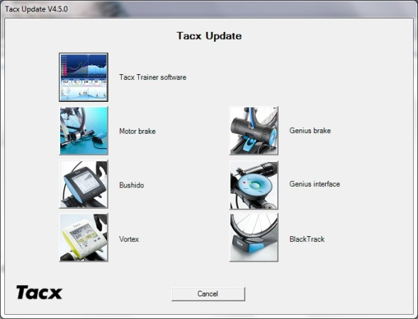

Grazie all'assistenza Tacx sono riuscito a risolvere i miei problemi con il rullo TACX Vortex Smart che consisteva in una lettura veramente sballata della potenza.

#### Aggiornamento firmware rulli TACX Vortex Smart

E' successo che questa estate è uscito l'aggiornamento via app per smartphone che apriva il protocollo di comunicazione a software di terze parti (Trainerroad, Zwift, Kinomap ecc) detto FE-C ANT. Questo aggiornamento permetteva così ai software come Trainerrpad e Zwift di controllare la resistenza del rullo in base all'allenamento impostato.

Dopo questo aggiornamento ho notato subito che qualcosa non andava come prima, ero in difficoltà a mantenere la stessa potenza per gli stessi minuti rispetto a prima dell'aggiornamento. All'inizio davo la colpa alla mia forma fisica, e non nascondo di essermi un po' demotivato perchè alla fine di un allenamento che doveva essere semplice, ero distrutto.

Ho iniziato a scrivermi con il supporto tecnico della Tacx e continuavano a chiedermi se avessi l'ultimo aggiornamento e io prontamente, dopo aver verificato con l'apposita app del mio iphone, rispondevo che avevo già installato l'ultimo aggiornamento 3.1.7. Solo che non avevo capito che loro intendevano l'aggiornamento del firmware del rullo, che ho scoperto essere diverso da quello scaricabile dall'applicazione. Infatti installando il TTS 4, si accede all'utilità di aggiornamento, chiamata Tacx Updater che si collega via ANT al rullo e verifica la presenza di nuovi firmware. Infatti appena mi sono connesso con il rullo e aver selezionanto l'icona del Vortex, mi è stata segnalata la presenza del nuovo firmware 2.7 .

 

 

 

 

 

 

 

 

 

 

 

 

Oppure potete scaricare l'aggiornamento da questa pagina [Aggiornamento 2.7 rulli tacx Vortex smart](http://patches.tacxdata.com/firmware/vortex-bmm)

Fatto l'aggiornamento in pochissimi istanti, riavviato il rullo, mi sono messo subito i pantaloncini da bici e via con Zwift. Per prima cosa ho dovuto allentare la tensione del rullino sulla ruota posteriore e questo ha subito reso una pedalata più naturale. Prima mi sembrava di pedalare sul fango. Man mano che pedalavo mi rendevo conto di essere tornato alle potenze di sempre, e dopo allenamento ero soddisfatto senza essere distrutto come al solito. Avendo utilizzato per un po' di tempo lo Stages come misuratore di potenza ormai conosco bene o male le mie soglie varie CP, quindi vedo subito se qualcosa non funziona.

Vi consiglio di verificare ogni tanto se ci sono aggiornamenti per il vostro rullo, se notate comportamenti strani
