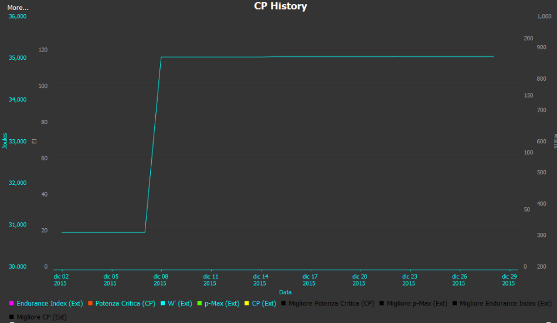
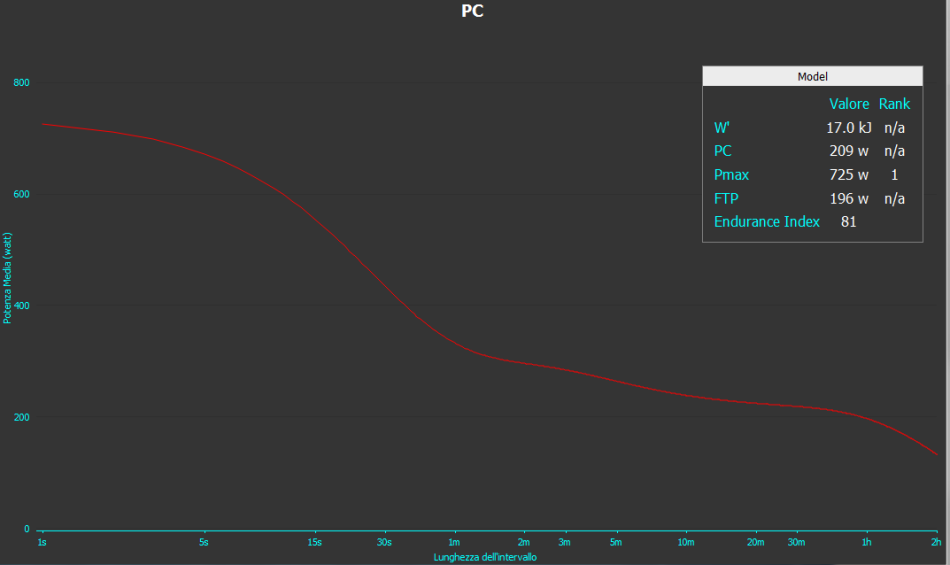
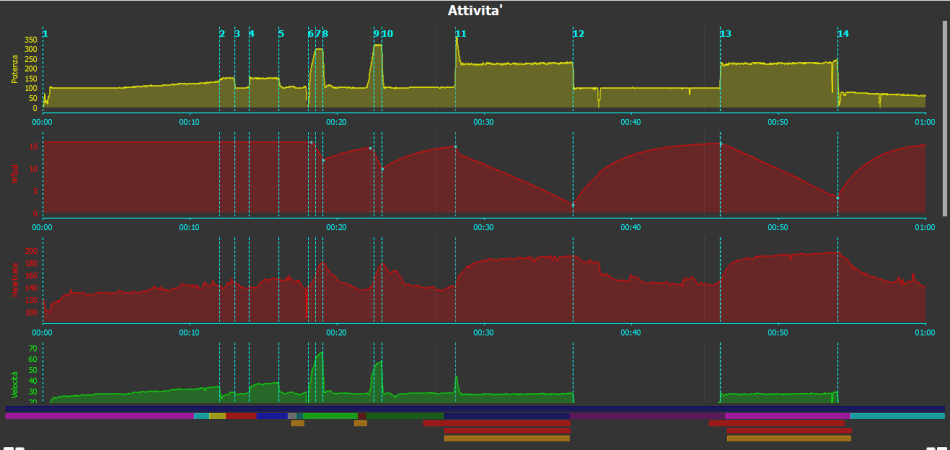

## Aumentare la propria FTP con Trainerroad

Dopo un 2015 disastroso dal punto di vista ciclistico (1.600 km totali) ho deciso che il 2016 deve essere l’anno della svolta, quindi da un paio di settimane ho iniziato a seguire il piano di allenamento di Trainerroad Sweetspot base - middle volume, con qualche modifica. Il piano originale prevede 3 allenamenti infrasettimanali (1h-1/2h-1h) e due nel week end (1.5h – 2h), ma sapendo già che non riuscirò a seguirlo così, farò 2 allenamenti infrasettimanali da 1 h e un di rulli + l’uscita nel weekend (tempo permettendo). Dopo il test iniziale della FTP che ha confermato il mio basso livello di forma (200watt con 78kg, 2.56 w/kg), spero di ritornare al livello del 2014 (245watt con 74kg, 3.31 w/kg) al più presto, ma non sarà facile 1° perché nel 2014 utilizzavo il misuratore di potenza e 2° perché non credo di avere le stesse motivazioni. Detto questo vi aggiornerò sui miei progressi e cercherò di pubblicare gli allenamenti svolti, anche come “certificazione” della qualità di Trainerroad. Naturalmente lo sto utilizzando in parallelo a Zwift per rendere stimolanti gli allenamenti, il fatto di visualizzare sul monitor un ambiente all’aperto con altri ciclisti non è da sottovalutare come fattore di distrazione (dalla monotonia del rullo) e di stimolo a fare di più (magari perché si vuole tenere la ruota di un altro utente di Zwift). Tutto questo grazie ad uno Smart Trainer Tacx, il Vortex precisamente, che posso assicurare essere molto fedele per quanto riguarda la stima dei watt.

Allego un po' di schermate di goldencheetah per farvi vedere la lenta ripresa degli allenamenti e la tristezza della mia condizione atletica.

  
