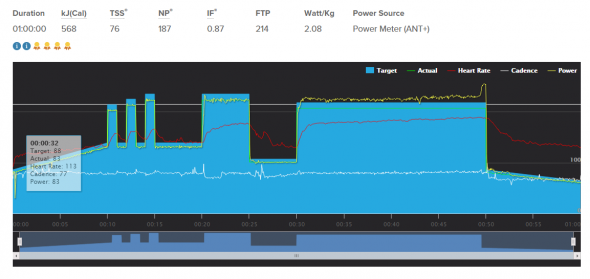
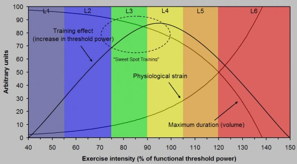
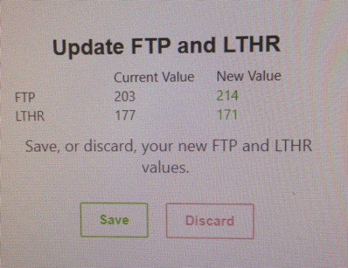

## Come migliorare la FTP in 6 settimane con Trainerroad?

Dopo sei settimane di di allenamento con Trainerroad SweetSpot base low volume, ho svolto ieri sera un test FTP per poter proseguire con la seconda fase della preparazione chiamata Building, e nel mio caso ho scelto la specialità adatta alla resistenza, quindi per chi predilige le salite lunghe e le granfondo. Eventualmente si possono scegliere dei percorsi più adatti a chi partecipa a gare brevi e in circuito, dove è richiesta molta potenza per brevi periodi tempo, oppure percorsi di allenamento più adatti a chi deve affrontare delle cronometro, o ache una serie di allenamenti più equilibrati che tentano di stimolare tutte le specialità senza enfatizzarne una in particolare. Ora vediamo come aumentare la FTP con Trainerroad.

\[caption id="attachment\_1102" align="aligncenter" width="590"\] test ftp 20 min - aumentare la FTP\[/caption\]

#### **Test FTP 20 minuti - Cosa è un test FTP ?**

E’ un allenamento svolto sui rulli, nel mio caso, che consente di stimare abbastanza facilmente la nostra Function theresold power, la nostra massima potenza esprimibile per un’ora di seguito, semplificando. Purtroppo sui rulli sarebbe veramente difficile pedalare alla nostra FTP per un’ora di seguito, quindi per comodità si prediligono questi test più brevi, per fare una stima abbastanza precisa della FTP. Tutto sommato anche se la stima non fosse corretta quello che è importante è svolgere sempre lo stesso test e sempre nelle stesse condizioni, in modo tale da poter misurare i nostri progressi e intervenire se stiamo sbagliando qualcosa sulla preparazione. Ci sono vari tipi di test FTP, dal semplice 2 serie da 8 minuti, che prevede di calcolare la media della potenza dei due intervalli e moltiplicarla per 0,90, oppure una serie da 20 minuti e moltiplicarla per 0,95. Oppure la migliore consiste in due serie da 20 minuti, ma è veramente troppo impegnativa. Di sicuro quella che non mi convince proprio è il test degli 8 minuti, perché logicamente “favorisce” chi è più capace di produrre tanta potenza per brevi periodi di tempo, falsando il risultato che dovrebbe essere relativo ad uno sforzo molto prolungato nel tempo. Io mi ritengo appunto tra questi che prediligono alta potenza per pochi minuti, perciò quando utilizzavo questo test, mi ritrovavo con dei riferimenti sballati per le salite lunghe.

#### **Aumentare la FTP**

Dicevo appunto di aver finito le prime 6 settimane del programma Sweetspot base a basso volume non avendo tanto tempo per allenarmi. Questo programma consiste in 2 allenamenti infrasettimanali e una uscita nel week-end. Un po’ pochino, ma sono riuscito ad aumentare la mia FTP del 6% circa. Devo dire anche che nel test di ieri mi sono accorto alla fine che avrei potuto dare di più, come dimostra il grafico alla fine, ma diciamo che mi accontento. Sicuramente passando da 4.5 ore settimanali di allenamento a 6/8 ore le cose cambierebbero drasticamente, ma mi alleno per fare meno fatica nelle uscite domenicali con gli amici, quindi mi va bene così.

#### **Programma Sweet Spot**

Cosa è un programma Sweet Spot? Semplificando si tratta di allenamenti adatti a chi ha poco tempo per allenarsi, quindi a basso volume di tempo, e ad una intensità ne blanda, ne troppo alta da non consentire un recupero ottimale per l’allenamento successivo. Di fatto un bilanciamento di allenamento per un determinato tempo, in quella zona d’ombra appena sotto la FTP, dovrebbe di conseguenza portare ad un massimo aumento di questa. Le intensità degli allenamenti andranno dalla Z2 alta alla zona appena sotto alla FTP circa 97%, quindi ci sarà pochissima Z4 e quasi per niente Z5. Di fatto può sembrare una metodologia di allenamento carente sotto tanti aspetti, ma svolta dopo un rientro da un infortunio o alla ripresa dopo la sosta invernale, secondo me è un ottima alternativa alla preparazione classica un po’ noiosa, soprattutto se uno non ha tempo ripeto. (Se volete approfondire qui c'è un sito che spiega molto bene cosa è l'[allenamento in SweetSpot](http://www.flammerouge.je/drills/sweetspot.htm))

\[caption id="attachment\_1103" align="aligncenter" width="590"\] sweet-spot - aumentare la FTP\[/caption\]

Vi allego l’allenamento svolto ieri, con l’avviso da parte di Trainerroad di aumentare la FTP. Direi che con la fase 2 del programma dovrebbe consentirmi un ulteriore aumento del 5% della mia FTP nei prossimo 2 mesi. Speriamo!

\[caption id="attachment\_1104" align="aligncenter" width="590"\] modify FTP - aumentare la FTP\[/caption\]
