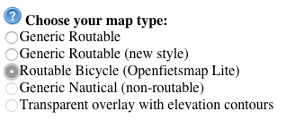
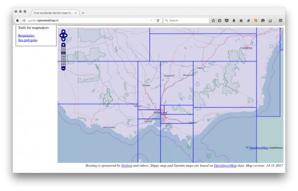
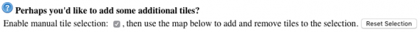
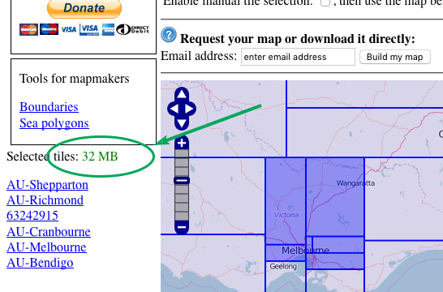
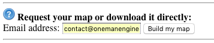
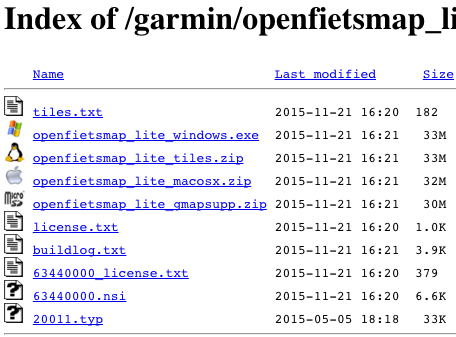
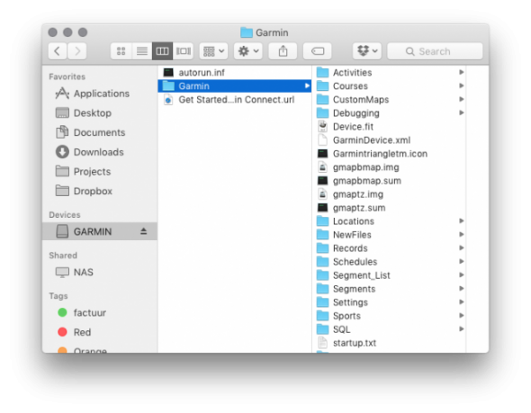
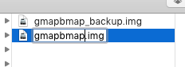
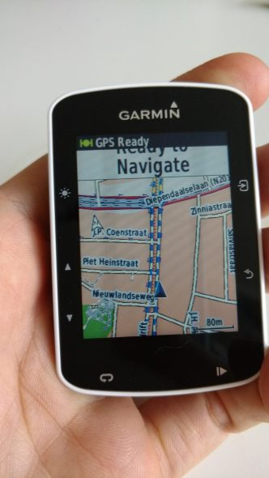

# Come installare le mappe Openstreetmap nel Garmin Edge 520

### Aggiornare le mappe originali del garmin edge 520 con le mappe Openstreetmap

Nella mia recensione su Garmin Edge 520 avevoscritto che si possono sostituire la mappe di base con quelle specifiche per la bicicletta, le Openstreetmap.  
Questo perchè le mappe originali sono meno dettagliate essendo pensate per le automobili e non visualizzano magari le stradine di campagna, o altre vie non accessibili se non con la bicicletta.  
Fortunatamente nel nostro edge 520 esiste la possibilità di installare le famosissime Openstreetmap seguento pochi semplicissimi passaggi:

#### Scaricare la propria mappa preferita

Prima cosa, andate su http://garmin.openstreetmap.nl/. E’ un sito dedicato che permette di trovare le mappe che vi servono, ed è gratuito!

Seconda cosa, scegliete il tipo di mappa ciclistica. È il primo menu del sito:

  
Se ve lo state chiedendo, ‘fiets’ in tedesco significa ‘bike’ (bici).  
Se saltate questo passaggio, la mappa non sarà molto utile, in quanto quelle specifiche per bici sono più leggere, così ce ne staranno di più e non daranno indicazioni per il passaggio su autostrade.  
Il passaggio successive è selezionare l’area della mappa che vogliamo importare sul nostro garmin. Potrete selezionare un intero stato, ma la mappa sarà talmente grande da non entrare nella limitata memoria del 520 (avete solo 100Mb di memoria). Come potete vedere la mappa è divisa in porzioni.

Dopo aver individuate la porzione di mappa di vostro interesse, dovrete abilitare la ‘manual selection’ appena sopra la mappa:

  
Adesso potete selezionare la porzione di mappa di Vostro interesse. Facendo questo, buttate un occhio sulla barra di sinistra, ci sarà una stima della pesantezza del file, quindi cercate di stare sotto i 90Mb (io consiglio 25/30Mb). Potete anche scaricare di più (circa 100Mb), ma avete bisogno di spazio per le vostre sessioni, strava and altri file. Se rimanete sotto i 90Mb avrete spazio a sufficienza per il file Garmin e Strava.

Una volta effettuata la selezione che più vi soddisfa, inserite la vostra email e la vostra mappa richiesta andrà in coda.

I server del sito genereranno un’unica mappa che include tutte le porzioni che avete scelto. Questo richiederà un po’ di tempo, dipende dalle richieste del server in quel momento. Solitamente entro 5/10 minuti

#### Installazione della mappa nel Vostro Garmin Edge 520

Una volta pronta riceverete un link sulla vostra email. Seguento il link sarete condotti in una pagina con alcuni download:

L’unico che vi serve è ‘openfietsmap\_lite\_gmapsupp.zip’. Quello sopra license.txt. Gli altri file servono nel caso in cui vogliate utilizzare la mappa su altre piattaforme, quindi ignorateli. Dopo che il download sarà completato, potrete decomprimere il file.  
Nel file zippato troverete un file gmapsupp.img (potreste non visualizzare l’estensione nel vostro sistema).  
Questo è il file da copiare nel vostro Garmin Edge 520. Perciò adesso che ce l’avete, procedete connettendo l’Edge 520 al Vostro PC utilizzando il cavo USB e aspettate che sia visualizzato come disco esterno nel Vostro sistema. Qui vedete una schermata del Mac, ma la procedura è la stessa in Windows.

In Edge 520 vedrete una cartella chiamata Garmin e dentro un file chiamato ‘gmapbmap.img’. La dimensione di tale file è di circa 45MB e si tratta del file che andremo a sovrascrivere.

**ATTENZIONE – IMPORTANTE!!**

Prima di sovrascrivere il file fatevi una copia in locale e tenetela al sicuro come un eventuale backup. Scaricatevi e rinominate il file ‘gmapsupp’ in ‘gmapbmap’ (mantenendo l’estensione .img). Nell’esempio ho mantenuto la mappa originale Garmin nella stessa cartella rinominandola con il suffisso \_backup. Rinominando la mappa scaricata in ‘gmapbmap’.

Adesso siete pronti per copiare la nuova mappa nel Garmin Edge 520. Copiate il file e selezionate l’opzione ‘sovrascrivi’ confermando con un ‘sì’. Aspettate che la copia sia terminata. Se avevate deciso si cancellare la mappa originale e poi copiare la nuov mappa, dovrete svuotare il cestino per liberare definitivamente la memoria del garmin..  
Poi, quando tutto è terminato, fate una rimozione sicura del Garmin 520. (tasto destroy del mouse su Garmin -> espelli). Dovrete effettuare la rimozione sicura per verificare che effettivamente la copia sia avvenuta con successo. Questo era l’ultimo passaggio, ora potete sconnettere il Garmin ed accenderlo. Verrà caricata la nuova mappa, che potrete vedere nella schermata di avvio (ci metterà qualche secondo ma è molto veloce) e sarete pronti ad utilizzarla!

Se avete domande o siete in difficoltà con la procedura, lasciate un comment sotto oppure contattatemi su Facebook, Twitter o Telegram. Sarò lieto di aiutarvi!  
Openstreetmap è un progetto open source, mantenuto da volontari che spendono il loro tempo sviluppando le mappe e aggiungendo informazioni. Potete dare il Vostro aiuto facendo una donazioneo fornendo voi stessi informazioni! L’hosting di Garmin OpenStreetMap è sponsorizzato da Oxilion e altri.  
P.S. Il Vostro Garmin 520 può funzionare anche senza mappe.  
P.P.S. Se ricevete un errore durante un aggiornamento a causa di mancaza di spazio, cancellate temporaneamente il file della mappa e copiatelo nuovamente dopo aver terminato l’aggiornamento software.

Se volete acquistare un Garmin Edge 520 potete farlo tramite Amazon e avere una maggiore garanzia sui prodotti.

Potete scegliere tra il Garmin Edge 520:

<iframe style="width:120px;height:240px;" marginwidth="0" marginheight="0" scrolling="no" frameborder="0" src="https://rcm-eu.amazon-adsystem.com/e/cm?ref=tf_til&amp;t=alexdelli04-21&amp;m=amazon&amp;o=29&amp;p=8&amp;l=as1&amp;IS1=1&amp;asins=B010SDBGQU&amp;linkId=8cf365b9cc84e1054d2c8b05a4c646cb&amp;bc1=ffffff&amp;lt1=_blank&amp;fc1=333333&amp;lc1=0066c0&amp;bg1=ffffff&amp;f=ifr"></iframe>

Oppure il suo successore Garmin Edge 520 Plus:

<iframe style="width:120px;height:240px;" marginwidth="0" marginheight="0" scrolling="no" frameborder="0" src="https://rcm-eu.amazon-adsystem.com/e/cm?ref=tf_til&amp;t=alexdelli04-21&amp;m=amazon&amp;o=29&amp;p=8&amp;l=as1&amp;IS1=1&amp;asins=B07D9N7WKB&amp;linkId=a5001ae947cab42d1aeb29991db33daa&amp;bc1=ffffff&amp;lt1=_blank&amp;fc1=333333&amp;lc1=0066c0&amp;bg1=ffffff&amp;f=ifr"></iframe>
