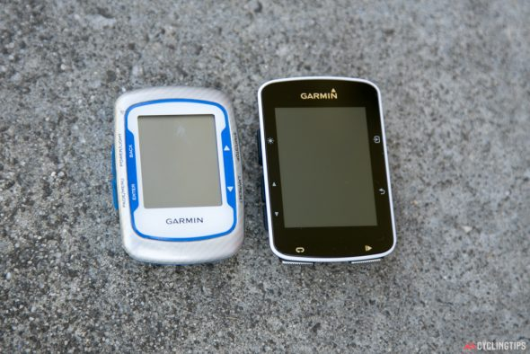
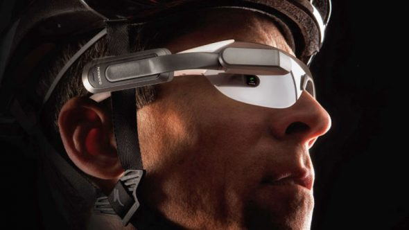
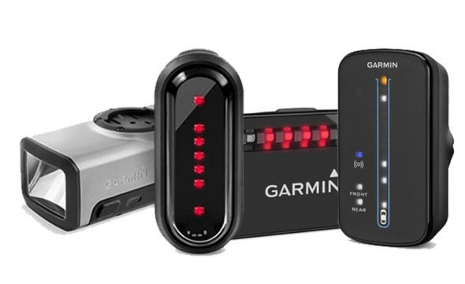

## Recensione Garmin Edge 520

A luglio 2015 Garmin ha messo sul mercato un nuovo GPS per gli amanti del ciclismo, un vero e proprio gioiello di tecnologia. A confronto del predecessore Edge 500, qualcuno potrebbe dire che sono la stessa cosa, a parte qualche miglioria a livello di display, come colori e ampiezza, ma non è così. Vediamo insieme le caratteristiche di questo dispositivo.

#### GPS

Intanto il sistema GPS può vantare il sistema di satelliti russo GLONASS, che non fa altro che aumentare la disponibilità dei satelliti e quindi rendere più veloce l’aggancio del segnale, più preciso e in caso di scarsa copertura, dovuta ad alberi ed altri ostacoli, anche una maggiore probabilità di captare il segnale. Utilizzare contemporaneamente il sistema gps e glonass porta ad un esaurimento più veloce della batteria.

#### HARDWARE

Per quando riguarda la parte estetica l’elemento che balza all’occhio è l’ampiezza dello schermo e la sua leggibilità (ben 2,3 pollici e 200x265 pixel), pur mantenendo delle dimensioni piuttosto compatte. Per fare un confronto con il vecchio 500 queste sono le dimensioni: 500 Lunghezza 69mm Larghezza 48mm Altezza 22mm Peso 57gr

520 Lunghezza 73mm Larghezza 49mm Altezza 21mm Peso 60gr

La durata della batteria è data per 15 ore, un po’ meno rispetto al predecessore, ma è sufficiente per almeno 3/4 uscite lunghe, quindi non è un problema. Ho fatto una uscita di 4 ore la domenica e il martedì altre 4 ore e mezza e la batteria era a metà. Considerando che sono ai primi cicli di ricarica l’autonomia non può che migliorare.

Nella confezione viene fornito sia l’attacco standard con gli elastici, sia il più moderno attacco per posizionare il dispositivo davanti al manubrio, per una lettura immediata e comoda. Ho trovato quest’ultimo poco estetico, in quanto mantiene il garmin sopra il livello del manubrio e la pipa, non a filo come con un'altra staffa garmin in mio possesso. Ho quindi deciso di tenere quest’ultima.

#### FUNZIONI

Qui potrei scrivere pagine e pagine, ma mi limito ad indicare le funzioni che sono più interessanti secondo me. C’è una maggiore attenzione alla parte misuratore di potenza, infatti il piccolo 520 permette di calcolare il VO2Max, che insieme all’impostazione dell’FTP, trasforma il dispositivo in un piccolo laboratorio che in tempo reale ci descrive la nostra performance. Naturalmente non sono in grado di dire se veramente sia affidabile il VO2Max che viene calcolato, ma perché non fidarsi ?? ;) Un’altra bella innovazione si chiama Connect IQ, una serie di app ancora in fase primordiale che abbelliscono e arricchiscono il garmin di nuove funzioni, graficamente molto belle ed immediate. Ad esempio ci sono delle dashboard analogiche che indicano velocità, potenza e zone di potenza / frequenza cardiaca. Ci sono ancora dei difetti da sistemare, come le impostazioni delle app che non rimangono memorizzate, ma Garmin in questi giorni ci sta lavorando, anzi dovrebbe essere uscito un nuovo firmware proprio la settimana scorsa. Connettendo il garmin con lo smartphone via Bluetooth saremo avvisati sia per SMS sia per chiamate in arrivo. Altra utilità è la possibilità di impostare n profili, ad esempio, allenamento, corsa, gara e per ognuno di questi impostare le schermate e i campi dati differenti. Ad esempio in gara non ci interessa l’ora del giorno o la temperatura, cosa che ci può interessare in una normale uscita domenicale. Devo dire che questa funzione la trovo veramente utile.

Se volete potete far interagire il 520 con la serie di luci Varia della Garmin, per comandarle dal dispositivo, oppure potrete visualizzare i campi dati direttamente negli occhialini Garmin Varia Vision, oppure tenere sotto controllo la situazione alle vostre spalle con il Varia Radar. Insomma ce n'è per tutti i gusti e per tutte le tasche aggiungo io. Il resto delle funzioni sono quelle basilari del garmin 500, qualcosa più qualcosa meno.

#### SEGMENTI STRAVA

Una delle funzioni che più mi piace è l’integrazione in tempo reale con Strava. Mediante un abbonamento Premium (non necessario) è possibile avere in tempo reale il confronto in un segmento con il nostro amico strava davanti a noi, oppure con la nostra Best prestation. Ho scritto che l’abbonamento premium non è necessario perché, se vogliamo ottenere lo stesso risultato basta importare a mano i segmenti sul dispositivo. Naturalmente è più scomodo rispetto all’abbonamento premium che permette di avere tutti i segmenti che si andranno a percorrere in tempo reale, basta mantenere il collegamento Bluetooth con lo smartphone.

#### CARTOGRAFIA

Utilissima la cartografia che potremmo utilizzare per seguire dei percorsi precaricati, oppure se ci siamo perso o non conosciamo le strade della zona. Personalmente ho caricato le mappe di Opencyclingmap che sono specifiche per la bicicletta, infatti indicano le fontane e tutti i punti di maggiore interesse per chi pedala. La procedura è molto semplice e ve la trovate [qui](http://alexdelli.it/2016/04/19/installare-openstreetmap-nel-garmin-edge-520/) 

 

#### VALUTAZIONE FINALE

Dopo alcune ore di utilizzo non posso che essere soddisfatto del 520, sia per quanto riguarda la precisione del segnale, ma venivo da un edge 500 che mi faceva impazzire quando perdeva il segnale nelle salite a quote elevate.

L'innesto sul supporto manubrio mi sembra molto più fluido e meno stressante per le alette che in passato si potevano rompere.

Le funzioni sono veramente tante e sfido chiunque ad utilizzarne solo la metà. Si tratta veramente di un gioiellino di tecnologia che abbinato ad un sensore di potenza esprime il massimo della sua potenzialità.
