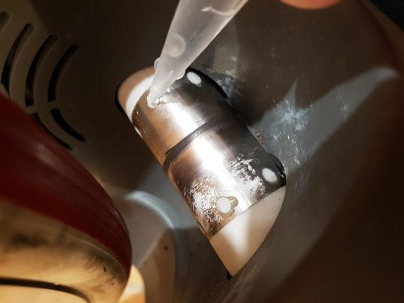

## Rumore rulli Tacx Vortex Smart: ecco la soluzione

State cercando una soluzione al rumore rulli Tacx Vortex Smart?

Siete stanchi di dovervi allenare con i tappi nelle orecchie?

Utilizzo i Tacx Vortex Smart da ormai due anni, ma già dopo qualche ora di utilizzo i rulli sono diventati via via più rumorosi, tanto da farmi quasi passare la voglia di spingere forte sui pedali per rovinarmi l'udito. L'utilizzo con i rapporti più lunghi generava un forte rumore tale da rendere fastidiosa ogni sessione indoor.  
Il rumore era simile al cartone che si metteva da piccoli sui raggi della bicicletta per farla semprare un motorino. Insomma era impossibile guardare un film o solo ascoltare musica mentre ci si allenava.  
Fortunatamente un ragazzo ha capito che la causa del problema è il cilindro di lamiera che avvolge il rullino in gomma che va a contatto con la ruota della bici.  
Probabilmente con l'utilizzo il calore dilata questo cilindro di metallo che si stacca leggermente dalla gomma.  
Infatti provando a forzarlo con le dita si sente che c'è del gioco tra il metallo e il rullo.

Non ci volevo creadere, ma appena ho provato a mettere in pratica questo piccolo trucco ho constato di persona che funzionava.  
Per risolvere il problema non serve altro che della semplice colla attaccatutto, come ad esempio [loctite](https://www.amazon.it/Loctite-Super-Attak-1604932-Istantaneo/dp/B0084OI4PC/ref=sr_1_3?ie=UTF8&qid=1507126272&sr=8-3&keywords=colla+loctite) o [qualsiasi altra marca](https://www.amazon.it/Colla-super-adesiva-Attaccatutto-Master/dp/B00EJK7GFO/ref=sr_1_5?ie=UTF8&qid=1507126247&sr=8-5&keywords=colla+attaccatutto).

\[caption id="attachment\_1212" align="aligncenter" width="590"\] Rumore rulli tacx voretx\[/caption\]

Va applicata all'interno dei forellini facendo attenzione a non farla colare. Prima dell'ultilizzo è meglio aspettare almeno una giornata in modo che la colla si sia indurita del tutto.  
Incredilmente quando riproverete il rullo vi sembrerà silenziosissimo in confronto a prima e da ora in avanti potrete allenarvi guardando il vostro film preferito o chattare con i vostri amici di Zwift.  
In conclusione vi auguro di godervi i vostri rulli come fossero nuovi.

## rumore tacx vortex

VI ricordo che potete acquistare questi rulli dall'ottimo rapporto qualità prezzo, direttamente su Amazon:

<iframe style="width:120px;height:240px;" marginwidth="0" marginheight="0" scrolling="no" frameborder="0" src="//rcm-eu.amazon-adsystem.com/e/cm?lt1=_blank&amp;bc1=000000&amp;IS2=1&amp;bg1=FFFFFF&amp;fc1=000000&amp;lc1=0000FF&amp;t=alexdelli04-21&amp;o=29&amp;p=8&amp;l=as4&amp;m=amazon&amp;f=ifr&amp;ref=as_ss_li_til&amp;asins=B00MCF5Q2I&amp;linkId=eecc3a7462220b71f3160f083bdef4f7"></iframe>
